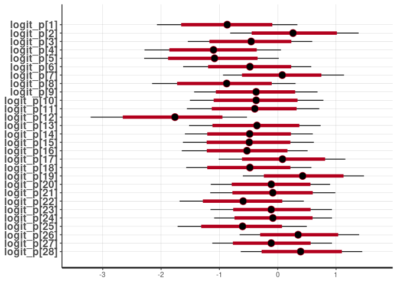

Convert group-by-individual data to long format
================

This is a short notebook describing how to convert group-by-individual
matrices to the long format used by BISON, and a brief demonstration of
how the model can be fitted.

``` r
library(dplyr)
```

    ## 
    ## Attaching package: 'dplyr'

    ## The following objects are masked from 'package:stats':
    ## 
    ##     filter, lag

    ## The following objects are masked from 'package:base':
    ## 
    ##     intersect, setdiff, setequal, union

``` r
library(rstan)
```

    ## Loading required package: StanHeaders

    ## Loading required package: ggplot2

    ## rstan (Version 2.21.2, GitRev: 2e1f913d3ca3)

    ## For execution on a local, multicore CPU with excess RAM we recommend calling
    ## options(mc.cores = parallel::detectCores()).
    ## To avoid recompilation of unchanged Stan programs, we recommend calling
    ## rstan_options(auto_write = TRUE)

## Simulate some data

For the example, simulate some random GBI data.

``` r
obs <- t(sapply(1:20, function(x) rbinom(8, 1, runif(1, min=0.2, max=0.4))))
obs
```

    ##       [,1] [,2] [,3] [,4] [,5] [,6] [,7] [,8]
    ##  [1,]    0    0    0    1    1    0    0    0
    ##  [2,]    1    1    1    0    0    0    0    1
    ##  [3,]    0    0    1    0    0    1    0    0
    ##  [4,]    0    0    0    0    0    0    0    0
    ##  [5,]    0    0    0    1    0    0    1    1
    ##  [6,]    0    0    0    0    1    0    0    0
    ##  [7,]    0    0    0    0    1    1    1    0
    ##  [8,]    1    0    1    0    1    0    1    1
    ##  [9,]    1    0    1    1    0    0    1    0
    ## [10,]    1    0    0    0    0    0    0    1
    ## [11,]    0    1    0    1    1    1    0    1
    ## [12,]    0    0    0    0    0    1    1    1
    ## [13,]    0    1    0    0    0    1    0    0
    ## [14,]    0    0    0    0    0    1    1    1
    ## [15,]    1    0    0    1    0    1    0    0
    ## [16,]    0    0    1    1    1    1    1    0
    ## [17,]    0    0    0    0    0    0    0    0
    ## [18,]    0    1    0    1    1    0    0    0
    ## [19,]    1    0    0    0    0    0    0    0
    ## [20,]    0    1    0    0    0    0    0    0

## Convert to long format

This code loops through each observation period (row in the GBI matrix)
and for each present individual iterates through all possible social
events that could have occurred in that observation period. Each social
event that could have theoretically been observed is included as a row
in the final dataframe, but only social events that were observed are
assigned `social_event=1`, the others being assigned `social_event=0`.
The ID of the observation period (the row id in the GBI matrix) is also
included so that pseudo-replication of data points can be accounted for
by including observation period as an effect in the model.

``` r
df <- data.frame(node_1=numeric(), node_2=numeric(), social_event=numeric(), obs_id=numeric())
for (obs_id in 1:nrow(obs)) {
  for (i in which(obs[obs_id, ] == 1)) {
    for (j in 1:ncol(obs)) {
      if (i != j) {
        # Swap i and j if necessary to make sure node_1 < node_2, not essential but makes things a bit easier when assigning dyad IDs.
        if (i < j) {
          node_1 <- i
          node_2 <- j
        } else {
          node_1 <- j
          node_2 <- i
        }
        df[nrow(df) + 1, ] <- list(node_1=node_1, node_2=node_2, social_event=(obs[obs_id, i] == obs[obs_id, j]), obs_id=obs_id)
      }
    }
  }
}
head(df)
```

    ##   node_1 node_2 social_event obs_id
    ## 1      1      4            0      1
    ## 2      2      4            0      1
    ## 3      3      4            0      1
    ## 4      4      5            1      1
    ## 5      4      6            0      1
    ## 6      4      7            0      1

## Prepare dataframe for Stan model

Add dyad IDs to the dataframe and convert observation (or group) IDs to
integers for indexing.

``` r
df <- df %>%
  group_by(node_1, node_2) %>%
  mutate(dyad_id=cur_group_id()) %>%
  mutate(obs_id=as.integer(obs_id))
head(df)
```

    ## # A tibble: 6 × 5
    ## # Groups:   node_1, node_2 [6]
    ##   node_1 node_2 social_event obs_id dyad_id
    ##    <dbl>  <dbl>        <dbl>  <int>   <int>
    ## 1      1      4            0      1       3
    ## 2      2      4            0      1       9
    ## 3      3      4            0      1      14
    ## 4      4      5            1      1      19
    ## 5      4      6            0      1      20
    ## 6      4      7            0      1      21

Prepare data list for model.

``` r
model_data <- list(
  N=nrow(df), # Number of observations
  M=length(unique(df$dyad_id)), # Number of dyads
  G=nrow(obs), # Number of groupings
  dyad_ids=df$dyad_id, # Vector of dyad IDs corresponding to each observation
  group_ids=df$obs_id, # Vector of group IDs corresponding to each observation
  event=df$social_event # Vector of binary values (0/1, presence/absence) corresponding to each observation
)
```

Compile and run model.

``` r
model <- stan_model("../models/group_model.stan")
```

``` r
fit <- sampling(model, model_data, cores=4)
```

Do a quick visualisation of the parameter values.

``` r
plot(fit, pars="logit_p")
```

    ## ci_level: 0.8 (80% intervals)

    ## outer_level: 0.95 (95% intervals)

<!-- --> The rest
of the analysis can proceed in the same way as the other analyses.
