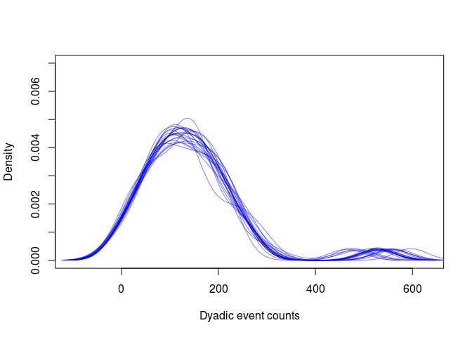
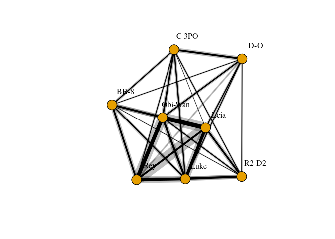
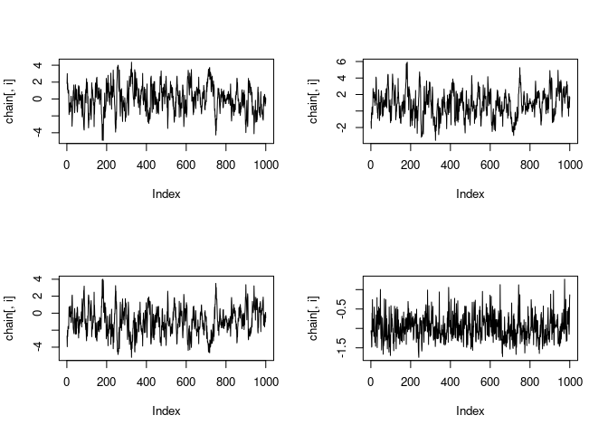
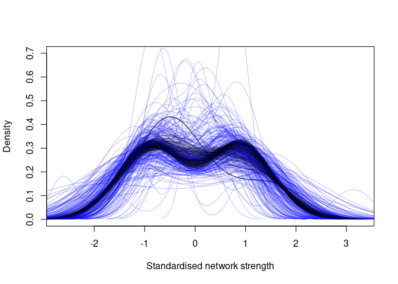

Count Data Example
================

This example covers fitting a edge weight model to count data (where the
count of social events per observation is recorded) with an
observation-level location effect, basic model checking and diagnostics,
visualising networks with uncertainty, calculating probability
distributions over network centrality, and propagating network
uncertainty into subsequent analyses.

# Setup

First of all we’ll load in Rstan for model fitting in Stan, dplyr for
handling the data, and igraph for network plotting and computing network
centrality. We also load in two custom R files: “simulations.R” to
generate synthetic data for this example; and “sampler.R” to allow
fitting models with uncertainty over network features respectively.

``` r
library(rstan)
library(dplyr)
library(igraph)

source("../scripts/simulations.R")
source("../scripts/sampler.R")
```

# Simulating data

Now we will simulate data using the `simulate_binary()` function. The
rows of the resulting dataframe describe observations at the dyadic
level between nodes. In this dataframe, `event` denotes whether or not
an undirected social event was observed in this observation period. The
exact definition of observation period will depend on the study, but is
commonly a sampling period where at least one of the members of the dyad
was observed. This can also be a sampling period where both members of
the dyad were observed, and the distinction will affect the
interpretation of edge weights. See the paper for further discussion on
this. `location` denotes the location at which the observation took
place, which may be relevant if location is likely to impact the
visibility of social events.

``` r
set.seed(1)
data <- simulate_count()
df <- data$df
head(df)
```

    ##   node_1  node_2   type_1   type_2 event_count location
    ## 1    Rey    Leia Lifeform Lifeform           3        C
    ## 2    Rey Obi-Wan Lifeform Lifeform           9        A
    ## 3    Rey Obi-Wan Lifeform Lifeform          26        F
    ## 4    Rey Obi-Wan Lifeform Lifeform           5        D
    ## 5    Rey Obi-Wan Lifeform Lifeform          13        A
    ## 6    Rey Obi-Wan Lifeform Lifeform          19        E

# Preparing the data

Computationally it’s easier to work with dyad IDs rather than pairs of
nodes in the statistical model, so we’ll map the pairs of nodes to dyad
IDs before we put the data into the model. The same is true for the
location factor, so we will also map the locations to location IDs. We
can add these columns to the dataframe using the following code:

``` r
df <- df %>%
  group_by(node_1, node_2) %>%
  mutate(dyad_id=cur_group_id()) %>%
  mutate(location_id=as.integer(location))
head(df)
```

    ## # A tibble: 6 × 8
    ## # Groups:   node_1, node_2 [2]
    ##   node_1 node_2  type_1   type_2   event_count location dyad_id location_id
    ##   <fct>  <fct>   <fct>    <fct>          <int> <fct>      <int>       <int>
    ## 1 Rey    Leia    Lifeform Lifeform           3 C              1           3
    ## 2 Rey    Obi-Wan Lifeform Lifeform           9 A              2           1
    ## 3 Rey    Obi-Wan Lifeform Lifeform          26 F              2           6
    ## 4 Rey    Obi-Wan Lifeform Lifeform           5 D              2           4
    ## 5 Rey    Obi-Wan Lifeform Lifeform          13 A              2           1
    ## 6 Rey    Obi-Wan Lifeform Lifeform          19 E              2           5

It will also be useful later to aggregate the dataframe at the dyad
level, assign dyad IDs corresponding to each dyad, and calculate total
event counts for each dyad. We can do this using:

``` r
df_agg <- df %>%
  group_by(node_1, node_2) %>%
  summarise(event_count_total=sum(event_count), dyad_id=cur_group_id()) %>%
  mutate(node_1_id=as.integer(node_1), node_2_id=as.integer(node_2))
head(df_agg)
```

    ## # A tibble: 6 × 6
    ## # Groups:   node_1 [1]
    ##   node_1 node_2  event_count_total dyad_id node_1_id node_2_id
    ##   <fct>  <fct>               <int>   <int>     <int>     <int>
    ## 1 Rey    Leia                    3       1         1         2
    ## 2 Rey    Obi-Wan               140       2         1         3
    ## 3 Rey    Luke                  169       3         1         4
    ## 4 Rey    C-3PO                  94       4         1         5
    ## 5 Rey    BB-8                  111       5         1         6
    ## 6 Rey    R2-D2                 241       6         1         7

Now we have all of the data in the right format for fitting the model,
we just need to put it into a list object. The data required by the
statistical model is defined in `binary_model.stan`.

``` r
model_data <- list(
  N=nrow(df), # Number of observations
  M=nrow(df_agg), # Number of dyads
  L=6, # Number of locations
  dyad_ids=df$dyad_id, # Vector of dyad IDs corresponding to each observation
  location_ids=df$location_id, # Vector of location IDs corresponding to each observation
  event_count=df$event_count # Vector of event counts corresponding to each observation
)
```

# Fitting the model

To fit the model, we first must compile it and load it into memory using
the function `stan_model()` and providing the filepath to the model. The
working directory will need to be set to the directory of the model for
this to work properly.

``` r
model <- stan_model("../models/count_model.stan")
```

Compiling the model may take a minute or two, but once this is done, the
model can be fit using `sampling()`. The argument `cores` sets the
number of CPU cores to be used for fitting the model, if your computer
has 4 or more cores, it’s worth setting this to 4.

``` r
fit <- sampling(model, model_data, cores=4, iter=5000, refresh=500)
```

# Model checking

The R-hat values provided by Stan indicate how well the chains have
converged, with values very close to 1.00 being ideal. Values diverging
from 1.00 indicate that the posterior samples may be very unreliable,
and shouldn’t be trusted. The chains can be plotted using Rstan’s
`traceplot` function to verify this visually:

``` r
traceplot(fit)
```

<!-- -->

Good R-hat values don’t necessarily indicate that the model is
performing well, only that the parameter estimates appear to be robust.
To check that the model is performing as it should, a predictive check
can be used. A predictive check uses the fitted model to make
predictions, and compares those predictions to the observed data. The
predictions should indicate that the observed data are concordant with
the predictions from the model. There are many ways to perform a
predictive check, as data can be summarised in many different ways. For
the purposes of this example, we’ll use a simple density check where the
probability distributions of the aggregated event counts are compared
against the predictions from the model. Note that this isn’t a guarantee
that the model predictions are good, only that the predictions have the
same event count distribution as the data. Ideally several predictive
checks would be used to check the performance of the model.

This check uses predictions generated by the Stan model as the quantity
`event_pred`, with one set of predictions for each step in the MCMC
chain. The predictive check will randomly sample 10 of these steps,
compute the event counts for each dyad, and plot the densities against
the density of the observed event counts from the data.

``` r
# Extract event predictions from the fitted model
event_pred <- extract(fit)$event_pred
num_iterations <- dim(event_pred)[1]

# Plot the density of the observed event counts
plot(density(df_agg$event_count_total), main="", xlab="Dyadic event counts", ylim=c(0, 0.007))

# Plot the densities of the predicted event counts, repeat for 10 samples
df_copy <- df
for (i in 1:20) {
  df_copy$event_count <- event_pred[sample(1:num_iterations, size=1), ]
  df_agg_copy <- df_copy %>% 
    group_by(node_1, node_2) %>%
    summarise(event_count_total=sum(event_count))
  lines(density(df_agg_copy$event_count_total), col=rgb(0, 0, 1, 0.5))
}
```

<!-- -->

This plot shows that the observed data falls well within the predicted
densities, and the predictions suggest the model has captured the main
features of the data well. Now we can be reasonably confident that the
model has fit correctly and describes the data well, so we can start to
make inferences from the model.

# Extracting edge weights

The main purpose of this part of the framework is to estimate edge
weights of dyads. We can access these using the `logit_p` quantity. This
will give a distribution of logit-scale edge weights for each dyad, akin
to an edge list. A more useful format for network data is usually
adjacency matrices, rather than edge lists, so instead we’ll convert the
distribution of edge lists to a distribution of adjacency matrices, and
store the result in an 8 x 8 x 4000 tensor, as there are 8 nodes and
4000 samples from the posterior.

``` r
log_p_samples <- extract(fit)$log_p

adj_tensor <- array(0, c(8, 8, num_iterations))
for (dyad_id in 1:model_data$M) {
  dyad_row <- df_agg[df_agg$dyad_id == dyad_id, ]
  adj_tensor[dyad_row$node_1_id, dyad_row$node_2_id, ] <- log_p_samples[, dyad_id]
}
adj_tensor[, , 1] # Print the first sample of the posterior distribution over adjacency matrices
```

    ##      [,1]      [,2]     [,3]     [,4]       [,5]      [,6]        [,7]
    ## [1,]    0 0.3888219 1.945788 1.609707  0.6244848 1.2066911  1.17293878
    ## [2,]    0 0.0000000 2.092089 1.756321 -0.2205671 1.1020841  1.14777047
    ## [3,]    0 0.0000000 0.000000 1.291345  1.0804066 1.0452480  0.69981998
    ## [4,]    0 0.0000000 0.000000 0.000000  0.8898372 0.9693547  1.23241904
    ## [5,]    0 0.0000000 0.000000 0.000000  0.0000000 0.6766154  0.35883036
    ## [6,]    0 0.0000000 0.000000 0.000000  0.0000000 0.0000000 -0.01262078
    ## [7,]    0 0.0000000 0.000000 0.000000  0.0000000 0.0000000  0.00000000
    ## [8,]    0 0.0000000 0.000000 0.000000  0.0000000 0.0000000  0.00000000
    ##            [,8]
    ## [1,] -1.6302939
    ## [2,]  0.7232529
    ## [3,]  0.8550568
    ## [4,]  0.4511401
    ## [5,]  1.2710819
    ## [6,]  0.2108423
    ## [7,]  0.5060542
    ## [8,]  0.0000000

The adjacency matrix above corresponds to a single draw of the posterior
adjacency matrices. You’ll notice that many of the entries are negative,
because the edge weights are on the logit scale. These can be
transformed back to the \[0, 1\] range using the logistic function. If
there are no additional effects (such as location in our case), the
transformed edge weights will be probabilities and the median will be
approximately the same as the simple ratio index for each dyad. However,
when additional effects are included, the transformed values can no
longer be interpreted as probabilities, though they may be useful for
visualisation and analysis purposes. We can logistic transform an
adjacency matrix using the logistic function (`plogis()` in base R).
This will also map 0 values to 0.5, so it will be necessary to set those
values back to zero again. This transformation can be achieved using the
following code:

``` r
plogis(adj_tensor[, , 1]) * upper.tri(adj_tensor[, , 1])
```

    ##      [,1]      [,2]      [,3]      [,4]      [,5]      [,6]      [,7]      [,8]
    ## [1,]    0 0.5959991 0.8749867 0.8333706 0.6512379 0.7697130 0.7636758 0.1637901
    ## [2,]    0 0.0000000 0.8901319 0.8527483 0.4450807 0.7506504 0.7591034 0.6733229
    ## [3,]    0 0.0000000 0.0000000 0.7843747 0.7465709 0.7398613 0.6681479 0.7016268
    ## [4,]    0 0.0000000 0.0000000 0.0000000 0.7088566 0.7249909 0.7742417 0.6109103
    ## [5,]    0 0.0000000 0.0000000 0.0000000 0.0000000 0.6629829 0.5887573 0.7809279
    ## [6,]    0 0.0000000 0.0000000 0.0000000 0.0000000 0.0000000 0.4968448 0.5525162
    ## [7,]    0 0.0000000 0.0000000 0.0000000 0.0000000 0.0000000 0.0000000 0.6238810
    ## [8,]    0 0.0000000 0.0000000 0.0000000 0.0000000 0.0000000 0.0000000 0.0000000

It will be necessary to use this transformation for the visualisations
and analyses we have planned, so we’ll apply the transformation to the
entire tensor:

``` r
adj_tensor_transformed <- adj_tensor
for (i in 1:dim(adj_tensor)[3]) {
  adj_tensor_transformed[, , i] <- plogis(adj_tensor[, , i]) * upper.tri(adj_tensor[, , i])
}
```

# Visualising uncertainty

The aim of our network visualisation is to plot a network where the
certainty in edge weights (edge weights) can be seen. To do this we’ll
use a semi-transparent line around each edge with a width that
corresponds to a standardised uncertainty measures. The uncertainty
measure will simply be the normalised difference between the 97.5% and
2.5% credible interval estimate for each edge weight. We can calculate
this from the transformed adjacency tensor object, generate two igraph
objects for the main network and the uncertainty in edges, and plot them
with the same coordinates.

``` r
# Calculate lower, median, and upper quantiles of edge weights. Lower and upper give credible intervals.
adj_quantiles <- apply(adj_tensor_transformed, c(1, 2), function(x) quantile(x, probs=c(0.025, 0.5, 0.975)))
adj_lower <- adj_quantiles[1, , ]
adj_mid <- adj_quantiles[2, , ]
adj_upper <- adj_quantiles[3, , ]

# Calculate standardised width/range of credible intervals.
adj_range <- ((adj_upper - adj_lower)/adj_mid)
adj_range[is.nan(adj_range)] <- 0

# Generate two igraph objects, one form the median and one from the standardised width.
g_mid <- graph_from_adjacency_matrix(adj_mid, mode="undirected", weighted=TRUE)
g_range <- graph_from_adjacency_matrix(adj_range, mode="undirected", weighted=TRUE)

# Plot the median graph first and then the standardised width graph to show uncertainty over edges.
coords <- igraph::layout_nicely(g_mid)
plot(g_mid, edge.width=3 * E(g_mid)$weight, edge.color="black",  layout=coords)
plot(g_mid, edge.width=2 * 3 * E(g_range)$weight, edge.color=rgb(0, 0, 0, 0.25), 
     vertex.label=c("Rey", "Leia", "Obi-Wan", "Luke", "C-3PO", "BB-8", "R2-D2", "D-O"), 
     vertex.label.dist=4, vertex.label.color="black", layout=coords, add=TRUE)
```

<!-- -->

This plot can be extended in multiple ways, for example by thresholding
low edge weights to visualise the network more tidily, or by adding
halos around nodes to show uncertainty around network centrality, and so
on.

# Extracting network centralities

Uncertainty around network metrics such as centrality can be calculated
quite simply by drawing adjacency matrices from the posterior
distribution over adjacency matrices, generating a network from them,
and calculating the network metric of interest. It is important to
sample over the adjacency matrices rather than by the edges on their
own, as this maintains the joint distribution of edge weights and will
generate more reliable and accurate estimates of network centrality.

``` r
centrality_matrix <- matrix(0, nrow=num_iterations, ncol=8)
for (i in 1:num_iterations) {
  g <- graph_from_adjacency_matrix(adj_tensor[, , i], mode="undirected", weighted=TRUE)
  centrality_matrix[i, ] <- strength(g)
}
colnames(centrality_matrix) <- c("Rey", "Leia", "Obi-Wan", "Luke", "C-3PO", "BB-8", "R2-D2", "D-O")
head(centrality_matrix)
```

    ##           Rey      Leia   Obi-Wan      Luke    C-3PO     BB-8    R2-D2      D-O
    ## [1,] 6.948431  7.210339  9.009753  8.200123 4.901256 5.210836 5.117833 4.017428
    ## [2,] 9.271843  9.949705 12.218536 11.017358 7.598594 7.768520 7.990548 5.864979
    ## [3,] 8.333923  8.837156  9.322010  8.487967 4.568646 5.628296 4.932234 3.964413
    ## [4,] 9.757895 10.215854 12.093086 11.262266 7.357669 8.038541 7.809732 6.226689
    ## [5,] 9.456858  9.482341 10.207148  9.535948 5.518692 6.430164 6.019957 5.312678
    ## [6,] 9.153037  9.769223 10.488500  9.706447 6.083325 6.376768 6.567181 5.919509

Each column in this matrix corresponds to one of the nodes in the
network, and each row is its centrality in one sample of the posterior
distribution of the adjacency matrices. We can calculate the credible
intervals using the `quantile` function as follows:

``` r
centrality_quantiles <- t(apply(centrality_matrix, 2, function(x) quantile(x, probs=c(0.025, 0.5, 0.975))))
centrality_quantiles
```

    ##             2.5%      50%     97.5%
    ## Rey     3.556837 8.072479 11.326488
    ## Leia    3.862988 8.513319 11.835374
    ## Obi-Wan 4.164406 9.633834 12.987251
    ## Luke    3.359254 8.727339 12.109814
    ## C-3PO   1.042970 5.229155  8.332258
    ## BB-8    1.484692 5.692858  9.014937
    ## R2-D2   1.317338 5.402971  8.638991
    ## D-O     0.709850 4.318573  7.335298

# Maintaining uncertainty in regression on centralities

The key challenge to quantifying uncertainty in network analysis is to
incorporate uncertainty due to sampling into downstream analyses,
commonly regression. This can be achieved by modifying the likelihood
function of a regression model to treat the network centralities with
uncertainty. We have written a custom MCMC sampler function that samples
from the joint distribution of network centralities calculated earlier
and treats those samples as the data in the likelihood function.
Likelihood functions for the sampler use the `index` variable to keep
track of which data points are being compared internally in the sampler,
to ensure that candidate steps in the MCMC are not accepted or rejected
because they are being compared to different data points, rather than
because of the parameter space.

Custom likelihood functions take a similar form to the `target +=`
syntax in Stan, but for more specific resources the following document
is a good start: <https://www.ime.unicamp.br/~cnaber/optim_1.pdf>. We
will implement a linear regression to test if lifeforms are more central
in the social network than droids. We have included a coefficient for
both lifeform and droid, unlike standard frequentist models. This is
because using a reference category (such as droid) would imply that
there is less uncertainty around the centrality of droids than around
lifeforms. It also allows for easy comparison between categories by
calculating the difference in posteriors.

``` r
loglik <- function(params, Y, X, index) {
  # Define parameters
  intercept <- params[1]
  beta_lifeform <- params[2]
  beta_droid <- params[3]
  sigma <- exp(params[4]) # Exponential keeps underlying value unconstrained, which is much easier for the sampler.
  
  # Sample data according to index
  y <- Y[index %% dim(Y)[1] + 1, ]
  
  # Define model
  target <- 0
  target <- target + sum(dnorm(y, mean=intercept + beta_lifeform * X[, 1] + beta_droid * X[, 2], sd=sigma, log=TRUE)) # Main model
  target <- target + dnorm(intercept, mean=0, sd=2.5, log=TRUE) # Prior on intercept
  target <- target + dnorm(beta_lifeform, mean=0, sd=2.5, log=TRUE) # Prior on lifeform coefficient
  target <- target + dnorm(beta_droid, mean=0, sd=2.5, log=TRUE) # Prior on droid coefficient
  target <- target + dexp(sigma, 1, log=TRUE) # Prior on sigma
  
  return(target)
}
```

Now we will prepare data for fitting the model. The predictor matrix is
simply a matrix with 2 columns and 8 rows, corresponding to whether each
of the 8 nodes is a lifeform (column 1) or a droid (column 2).

``` r
predictor_matrix <- matrix(0, nrow=8, ncol=2)
colnames(predictor_matrix) <- c("lifeform", "droid")
predictor_matrix[1:4, 1] <- 1
predictor_matrix[5:8, 2] <- 1
predictor_matrix
```

    ##      lifeform droid
    ## [1,]        1     0
    ## [2,]        1     0
    ## [3,]        1     0
    ## [4,]        1     0
    ## [5,]        0     1
    ## [6,]        0     1
    ## [7,]        0     1
    ## [8,]        0     1

Since network strength is strictly positive, a Gaussian error is not a
reasonable model for the data. The Gaussian family model is much easier
to implement as well as interpret than many other models, so we will
standardise the centralities by taking z-scores.

``` r
centrality_matrix_std <- (centrality_matrix - apply(centrality_matrix, 1, mean))/apply(centrality_matrix, 1, sd)
centrality_matrix_std[is.nan(centrality_matrix_std)] <-0
head(centrality_matrix_std)
```

    ##            Rey      Leia  Obi-Wan      Luke      C-3PO       BB-8      R2-D2
    ## [1,] 0.3509577 0.4988716 1.515103 1.0578592 -0.8051984 -0.6303615 -0.6828854
    ## [2,] 0.1513382 0.4803181 1.581426 0.9984710 -0.6607219 -0.5782533 -0.4704990
    ## [3,] 0.7189098 0.9486700 1.170039 0.7892412 -1.0001979 -0.5163951 -0.8341951
    ## [4,] 0.3233822 0.5468629 1.462939 1.0575047 -0.8479108 -0.5156498 -0.6273070
    ## [5,] 0.8159278 0.8280775 1.173640 0.8536350 -1.0616505 -0.6270932 -0.8226654
    ## [6,] 0.5912540 0.9094288 1.280836 0.8770136 -0.9938278 -0.8423053 -0.7439831
    ##            D-O
    ## [1,] -1.304346
    ## [2,] -1.502079
    ## [3,] -1.276072
    ## [4,] -1.399821
    ## [5,] -1.159871
    ## [6,] -1.078416

Now we’re in a position to fit the model. To do this, we define the
target function, which is simply a function that maps candidate
parameters and a network centrality index to the log-likelihood of that
function for the given sample of the centrality posterior. This means
the target function can be written as a function of the data
`centrality_matrix_std` and `predictor_matrix`.

``` r
target <- function(params, index) loglik(params, centrality_matrix_std, predictor_matrix, index)
```

The function `metropolis` from `sampler.R` can now be used to fit the
model using the provided target function, an initial set of parameters,
and some additional MCMC options.

``` r
chain <- metropolis(target, c(0, 0, 0, 0), iterations=100000, thin=100, refresh=10000)
```

    ## Chain: 1 | Iteration: 10000/102000 (Sampling)
    ## Chain: 1 | Iteration: 20000/102000 (Sampling)
    ## Chain: 1 | Iteration: 30000/102000 (Sampling)
    ## Chain: 1 | Iteration: 40000/102000 (Sampling)
    ## Chain: 1 | Iteration: 50000/102000 (Sampling)
    ## Chain: 1 | Iteration: 60000/102000 (Sampling)
    ## Chain: 1 | Iteration: 70000/102000 (Sampling)
    ## Chain: 1 | Iteration: 80000/102000 (Sampling)
    ## Chain: 1 | Iteration: 90000/102000 (Sampling)
    ## Chain: 1 | Iteration: 100000/102000 (Sampling)
    ## Acceptance Rate: 0.231392156862745

``` r
colnames(chain) <- c("intercept", "beta_lifeform", "beta_droid", "sigma")
head(chain)
```

    ##       intercept beta_lifeform   beta_droid      sigma
    ## [1,]  1.4296254   -0.79038870 -2.070353847 -1.1567064
    ## [2,]  0.5052134   -0.05715052 -1.033996971 -1.0873873
    ## [3,] -0.7200746    1.69171100  0.006346761 -1.1292841
    ## [4,] -0.3002469    1.59470319 -0.951014682 -1.2249229
    ## [5,]  0.1960285    0.84342446 -1.267537000 -1.3621135
    ## [6,]  0.8327115    0.26584086 -1.596906471 -0.6336673

# Checking the regression

The resulting chain of MCMC samples forms the posterior distribution of
parameter estimates for the regression model. But before we look at
these too closely, we should check that the chains have converged:

``` r
par(mfrow=c(2, 2))
for (i in 1:4) {
  plot(chain[, i], type="l")
}
```

<!-- -->

These chains appear to be quite healthy. Ideally we would run multiple
additional chains starting at different points to check that they
converge and mix properly. For the sake of this example we won’t go into
that here.

Again, the performance of the sampler doesn’t necessarily guarantee the
performance of the model, so we’ll use predictive checks to test the
performance of the model. In this case, the data are not fixed, and
there are multiple possible values they can take. Therefore we’ll plot
the distribution of centrality values on different draws of the
adjacency matrices as well as the distribution of predicted centrality
values on different draws.

``` r
plot(density(centrality_matrix_std[1, ]), ylim=c(0, 0.7), main="", xlab="Standardised network strength")
sample_ids <- sample(1:1000, size=200)
for (i in sample_ids) {
  pred <- rnorm(8, mean=chain[i, "intercept"] + chain[i, "beta_lifeform"] * predictor_matrix[, 1] + chain[i, "beta_droid"] * predictor_matrix[, 2], sd=exp(chain[i, "sigma"]))
  lines(density(centrality_matrix_std[i, ]), col=rgb(0, 0, 0, 0.25))
  lines(density(pred), col=rgb(0, 0, 1, 0.25))
}
```

<!-- -->

The model appears to fit reasonably well, and the observed data are
completely consistent with the predictions of the model, so we can go
ahead with the analysis.

# Interpreting the regression

The regression coefficients and parameters can be summarised by
calculating their percentile credible interval similar to before:

``` r
coefficient_quantiles <- t(apply(chain, 2, function(x) quantile(x, probs=c(0.025, 0.5, 0.975))))
coefficient_quantiles
```

    ##                    2.5%        50%     97.5%
    ## intercept     -2.816392  0.2436177  2.741131
    ## beta_lifeform -1.950923  0.6487364  3.715604
    ## beta_droid    -3.734745 -1.0962505  1.850773
    ## sigma         -1.520235 -1.0081618 -0.303181

A frequentist analysis (and some Bayesian ones too) would have only one
category, lifeform or droid, and the other category would be the
implicit reference category, absorbed by the intercept. In this type of
analysis, the coefficients for the two categories correspond to the
average difference between the centrality of nodes in that category
compared to the population average (the intercept). Therefore, to look
for a difference between the two categories, we can simply calculate the
difference in the posterior distributions of those two categories:

``` r
beta_difference <- chain[, "beta_lifeform"] - chain[, "beta_droid"]
quantile(beta_difference, probs=c(0.025, 0.5, 0.975))
```

    ##     2.5%      50%    97.5% 
    ## 1.159501 1.747547 2.299188

The mass of probability is with there being a positive difference of
around 1.57 standard deviations between the centralities of lifeforms
compared to droids. Many of the benefits of Bayesian analysis only apply
when significance testing is avoided. Though it is reasonably common for
a result such as the one above not overlapping zero to be interpreted as
being “significant”, using such a decision rule leaves Bayesian analysis
open to the same flaws as frequentist analyses often have. For this
reason we caution strongly against using such a rule.

# Conclusion

In this guide we have shown how to apply the edge weight model to binary
presence/absence data and how to conduct subsequent analyses, while
maintaining uncertainty through the whole process. Though this process
is quite hands-on, it provides a huge amount of flexibility for
conducting animal social network analyses in a robust and interpretable
way.
