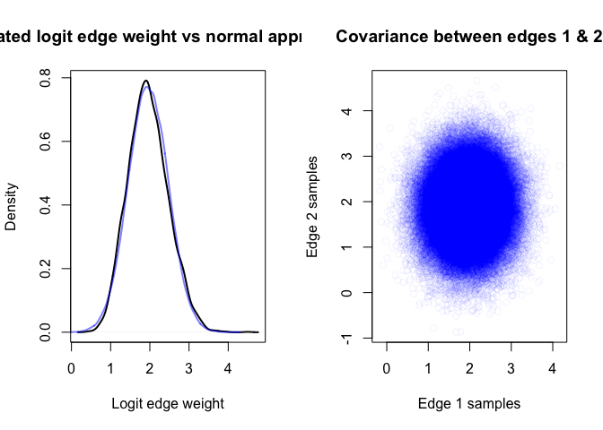
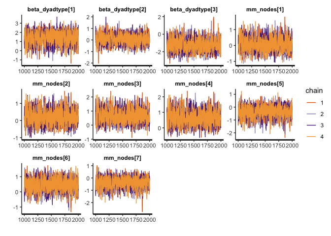
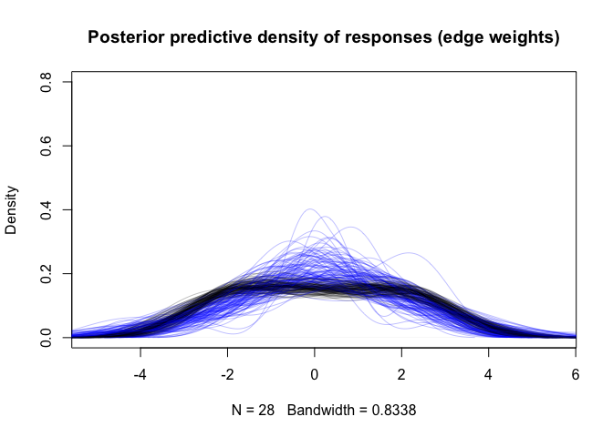
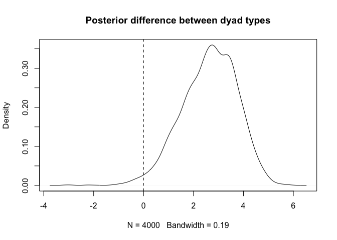

Dyadic Regression with Stan
================

Dyadic regression is a regression-based analysis often used in social
network analysis to determine factors that may be associated with edge
weight, for example, age difference or combination of sexes. In this
notebook we will use edge weight posteriors from a previously-run edge
weight model to conduct a dyadic regression of edge weight against dyad
type. In our toy example, dyad type will be one of `lifeform-lifeform`,
`lifeform-droid`, and `droid-droid`.

BISoN adopts a fully Bayesian philosophy, so not only does it use edge
weight models to estimate uncertainty over edge weights, but it also
propagates this uncertainty through downstream analyses, such as dyadic
regression in this case. There are several ways uncertainty over edge
weights can be included in regression analyses, but in this example we
will use a normal approximation of edge weight posteriors in a Stan
model to propagate uncertainty.

# Setup and Loading the edge weights

We’ll load edge weight posteriors in from a previous run model using the
`readRDS()` function. These data were generated by the `ewm_binary.Rmd`
example in the Github repository.

``` r
library(rstan)
```

    ## Loading required package: StanHeaders

    ## Loading required package: ggplot2

    ## rstan (Version 2.21.3, GitRev: 2e1f913d3ca3)

    ## For execution on a local, multicore CPU with excess RAM we recommend calling
    ## options(mc.cores = parallel::detectCores()).
    ## To avoid recompilation of unchanged Stan programs, we recommend calling
    ## rstan_options(auto_write = TRUE)

``` r
data <- readRDS("../example_data/binary.RData")
df <- data$df
df_agg <- data$df_agg
logit_edge_samples <- data$logit_edge_samples
```

# Defining the model

The dyadic regression model we’ll be using will predict the edge weight
using a Gaussian family model where dyad type is the main effect, and
multi-membership terms are included as random effects to account for
non-independence between edges due to nodes. Since edge weights can
co-vary, we need to model the joint posterior distributions over edge
weights as the response variable in the regression model. This can be
achieved by modelling the mean edge weights `y_mu` as a multivariate
normal with a covariance matrix `y_sigma` calculated from the edge
weight posterior. In Stan this looks like:

`logit_edge_mu ~ multi_normal(predictor, logit_edge_cov + diag_matrix(rep_vector(square(sigma), N)));`

where `predictor` is the predictor term (like `a + b * x` in simple
linear regression). Modelling edge weights with a multivariate normal
allows the joint uncertainty over edge weights to be taken into account
by the model. Weakly informative priors are used in this example, but in
any real analysis they should be determined by domain knowledge and
predictive checks.

``` r
model_dyadic <- stan_model("../models/dyadic_regression.stan")
```

    ## Trying to compile a simple C file

    ## Running /Library/Frameworks/R.framework/Resources/bin/R CMD SHLIB foo.c
    ## clang -mmacosx-version-min=10.13 -I"/Library/Frameworks/R.framework/Resources/include" -DNDEBUG   -I"/Library/Frameworks/R.framework/Versions/4.1/Resources/library/Rcpp/include/"  -I"/Library/Frameworks/R.framework/Versions/4.1/Resources/library/RcppEigen/include/"  -I"/Library/Frameworks/R.framework/Versions/4.1/Resources/library/RcppEigen/include/unsupported"  -I"/Library/Frameworks/R.framework/Versions/4.1/Resources/library/BH/include" -I"/Library/Frameworks/R.framework/Versions/4.1/Resources/library/StanHeaders/include/src/"  -I"/Library/Frameworks/R.framework/Versions/4.1/Resources/library/StanHeaders/include/"  -I"/Library/Frameworks/R.framework/Versions/4.1/Resources/library/RcppParallel/include/"  -I"/Library/Frameworks/R.framework/Versions/4.1/Resources/library/rstan/include" -DEIGEN_NO_DEBUG  -DBOOST_DISABLE_ASSERTS  -DBOOST_PENDING_INTEGER_LOG2_HPP  -DSTAN_THREADS  -DBOOST_NO_AUTO_PTR  -include '/Library/Frameworks/R.framework/Versions/4.1/Resources/library/StanHeaders/include/stan/math/prim/mat/fun/Eigen.hpp'  -D_REENTRANT -DRCPP_PARALLEL_USE_TBB=1   -I/usr/local/include   -fPIC  -Wall -g -O2  -c foo.c -o foo.o
    ## In file included from <built-in>:1:
    ## In file included from /Library/Frameworks/R.framework/Versions/4.1/Resources/library/StanHeaders/include/stan/math/prim/mat/fun/Eigen.hpp:13:
    ## In file included from /Library/Frameworks/R.framework/Versions/4.1/Resources/library/RcppEigen/include/Eigen/Dense:1:
    ## In file included from /Library/Frameworks/R.framework/Versions/4.1/Resources/library/RcppEigen/include/Eigen/Core:88:
    ## /Library/Frameworks/R.framework/Versions/4.1/Resources/library/RcppEigen/include/Eigen/src/Core/util/Macros.h:628:1: error: unknown type name 'namespace'
    ## namespace Eigen {
    ## ^
    ## /Library/Frameworks/R.framework/Versions/4.1/Resources/library/RcppEigen/include/Eigen/src/Core/util/Macros.h:628:16: error: expected ';' after top level declarator
    ## namespace Eigen {
    ##                ^
    ##                ;
    ## In file included from <built-in>:1:
    ## In file included from /Library/Frameworks/R.framework/Versions/4.1/Resources/library/StanHeaders/include/stan/math/prim/mat/fun/Eigen.hpp:13:
    ## In file included from /Library/Frameworks/R.framework/Versions/4.1/Resources/library/RcppEigen/include/Eigen/Dense:1:
    ## /Library/Frameworks/R.framework/Versions/4.1/Resources/library/RcppEigen/include/Eigen/Core:96:10: fatal error: 'complex' file not found
    ## #include <complex>
    ##          ^~~~~~~~~
    ## 3 errors generated.
    ## make: *** [foo.o] Error 1

# Compute normal approximation

To parameterise the multivariate normal approximation, we use the sample
mean and covariance matrix, calculated from the posterior edge weight
samples using the following code:

``` r
logit_edge_mu <- apply(logit_edge_samples, 2, mean)
logit_edge_cov <- cov(logit_edge_samples)
```

These quantities will be given to the Stan model as data to model joint
posteriors of edge weight in the regression. We can run a few quick
plots to see how well the approximation is working and the covariance
between one pair of edge weights.

``` r
edge_samples <- MASS::mvrnorm(1e5, logit_edge_mu, logit_edge_cov)
par(mfrow=c(1, 2))
plot(density(logit_edge_samples[, 1]), lwd=2, main="Estimated logit edge weight vs normal approximation", xlab="Logit edge weight")
lines(density(edge_samples[, 1]), col=rgb(0, 0, 1, 0.5), lwd=2)

plot(edge_samples[, 1], edge_samples[, 2], col=rgb(0, 0, 1, 0.05), main="Covariance between edges 1 & 2", xlab="Edge 1 samples", ylab="Edge 2 samples")
```

<!-- -->
If we’re happy with the approximation, we can now get ready to fit the
model.

# Fit the model

The model can be fitted using the following code:

``` r
model_data <- list(
  N = 28, # Number of dyads
  K = 8, # Number of nodes
  logit_edge_mu = logit_edge_mu, # Sample means of logit edge weights
  logit_edge_cov = logit_edge_cov, # Sample covariance of logit edge weights
  dyad_type = as.integer(df_agg$dyad_type), # Integer dyad types corresponding to "ll", "ld", and "dd"
  node_1_id = df_agg$node_1_id, # Node IDs for multimembership effects
  node_2_id = df_agg$node_2_id # Node IDs for multimembership effects
)

fit_dyadic <- sampling(model_dyadic, data=model_data, cores=4)
```

# Diagnostics

Now the model is fitted, we can check the traceplots to make sure the
chains have converged.

``` r
traceplot(fit_dyadic)
```

    ## 'pars' not specified. Showing first 10 parameters by default.

<!-- -->

The chains are stationary and well-mixed so we should be able to proceed
with model diagnostics.

# Posterior predictive checks

We will run a brief diagnostic check by comparing the density of
expected edge weights (draws of which are shown in black) against the
density of predicted edge weights from the regression model (draws of
which are shown in blue).

``` r
params <- rstan::extract(fit_dyadic)
plot(density(logit_edge_samples[1, ]), main="Posterior predictive density of responses (edge weights)", ylim=c(0, 0.8), col=rgb(0, 0, 0, 0.25))
for (i in 1:100) {
  j <- sample(1:4000, 1)
  lines(density(logit_edge_samples[j, ]), col=rgb(0, 0, 0, 0.25))
  mu <- params$beta_dyadtype[j, model_data$dyad_type] + params$mm[j, model_data$node_1_id] + params$mm[j, model_data$node_2_id]
  sigma <- model_data$logit_edge_cov + diag(rep(params$sigma[j], 28))
  lines(density(MASS::mvrnorm(1, mu, sigma)), col=rgb(0, 0, 1, 0.25))
}
```

<!-- -->
Almost all of the expected (black) densities fall within the range
expected from the predicted (blue) densities. The distribution of edge
weights appears to have been captured well by the regression model.
There are many other types of diagnostic check that could be carried
out, but we won’t go into detail here. See the github repository page
for more information.

# Interpreting the model

Assuming we’ve now carried out any diagnostics we think are appropriate,
it’s finally time to answer the scientific questions that led us to
conduct the analysis. We can start off by calculating the 95% credible
intervals of the model parameters. This can be done using the following
code:

``` r
round(summary(fit_dyadic)$summary[1:13, c(1, 4, 8)], 2)
```

    ##                   mean  2.5% 97.5%
    ## beta_dyadtype[1]  1.39 -0.05  2.59
    ## beta_dyadtype[2]  0.07 -0.77  0.91
    ## beta_dyadtype[3] -1.24 -2.49  0.27
    ## mm_nodes[1]       0.08 -0.67  0.93
    ## mm_nodes[2]       0.20 -0.57  1.08
    ## mm_nodes[3]       0.64 -0.15  1.59
    ## mm_nodes[4]       0.64 -0.17  1.60
    ## mm_nodes[5]      -0.38 -1.31  0.41
    ## mm_nodes[6]       0.47 -0.35  1.25
    ## mm_nodes[7]      -0.38 -1.31  0.37
    ## mm_nodes[8]      -1.14 -2.22 -0.13
    ## sigma             0.53  0.17  1.17
    ## sigma_mm          0.76  0.25  1.50

At this point it becomes clear that the regression we’ve conducted is
not exactly the same as what might be expected from standard frequentist
regressions, where categories are interpreted relative to a reference
category. Instead, a parameter is estimated for each category, and we
can use *contrasts* to calculate the magnitude of differences between
categories of interest. Contrasts are easily calculated as the statistic
of interest from the posteriors of the model. Namely, if we’re interest
in whether lifeform-lifeform edges are stronger than lifeform-droid
edges, we simply compute the difference in posteriors between `b_ll` and
`b_ld`. This can be done using the following code:

``` r
params <- rstan::extract(fit_dyadic)
beta_diff <- params$beta_dyadtype[, 1] - params$beta_dyadtype[, 3]
plot(density(beta_diff), main="Posterior difference between dyad types")
abline(v=0, lty=2)
```

<!-- -->

``` r
beta_diff_summary <- round(quantile(beta_diff, probs=c(0.5, 0.025, 0.975)), 2)
beta_diff_summary
```

    ##   50%  2.5% 97.5% 
    ##  2.72  0.33  4.55

This gives us an estimate that lifeform-lifeform edge weights are
generally around \~2.8 logit-scale units stronger than lifeform-droid
edges, with a 95% credible interval of around \~(0.1, 4.5).

# Conclusion

This notebook has given a brief overview of how to fit and interpret a
dyadic regression model using a normal approximation of logit edge
weights in Stan. We also have a guide on how to conduct the same type of
analysis without approximation using a Metropolis-Hastings sampler,
which should yield similar results and be more flexible, but may be more
prone to model fitting issues.
