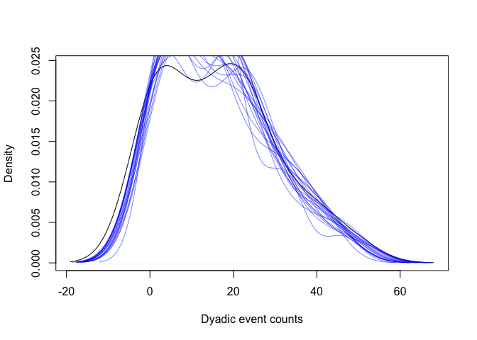
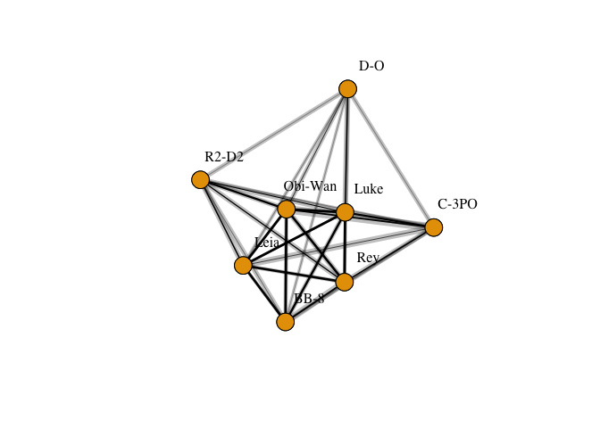

Binary Edge Weight Model
================

This example covers fitting an edge weight model to presence/absence
(binary) data with an observation-level location effect.

*Note: Many of the procedures presented here are stochastic, and plots
and results may vary between compilations of this document. In
particular, MCMC chains and model estimates may sometimes not be
optimal.*

# Setup

First of all we’ll load in Rstan for model fitting in Stan, dplyr for
handling the data, and igraph for network plotting and computing network
centrality. We also load in a custom R file: “simulations.R” to generate
synthetic data for this example..

``` r
library(rstan)
library(dplyr)
library(igraph)

source("../scripts/simulations.R")
```

# Simulating data

Now we will simulate data using the `simulate_binary()` function. The
rows of the resulting dataframe describe observations at the dyadic
level between nodes. In this dataframe, `event` denotes whether or not
an undirected social event was observed in this observation period. The
exact definition of observation period will depend on the study, but is
commonly a sampling period where at least one of the members of the dyad
was observed. This can also be a sampling period where both members of
the dyad were observed, and the distinction will affect the
interpretation of edge weights. See the paper for further discussion on
this. `location` denotes the location at which the observation took
place, which may be relevant if location is likely to impact the
visibility of social events.

``` r
set.seed(123)
data <- simulate_binary()
df <- data$df
head(df)
```

    ##   node_1 node_2   type_1   type_2 event location
    ## 1    Rey   Leia Lifeform Lifeform     1        A
    ## 2    Rey   Leia Lifeform Lifeform     1        F
    ## 3    Rey   Leia Lifeform Lifeform     1        A
    ## 4    Rey   Leia Lifeform Lifeform     1        B
    ## 5    Rey   Leia Lifeform Lifeform     0        E
    ## 6    Rey   Leia Lifeform Lifeform     1        D

# Preparing the data

Computationally it’s easier to work with dyad IDs rather than pairs of
nodes in the statistical model, so we’ll map the pairs of nodes to dyad
IDs before we put the data into the model. The same is true for the
location factor, so we will also map the locations to location IDs. We
can add these columns to the dataframe using the following code:

``` r
df <- df %>%
  group_by(node_1, node_2) %>%
  mutate(dyad_id=cur_group_id()) %>%
  mutate(location_id=as.integer(location))
head(df)
```

    ## # A tibble: 6 × 8
    ## # Groups:   node_1, node_2 [1]
    ##   node_1 node_2 type_1   type_2   event location dyad_id location_id
    ##   <fct>  <fct>  <fct>    <fct>    <int> <fct>      <int>       <int>
    ## 1 Rey    Leia   Lifeform Lifeform     1 A              1           1
    ## 2 Rey    Leia   Lifeform Lifeform     1 F              1           6
    ## 3 Rey    Leia   Lifeform Lifeform     1 A              1           1
    ## 4 Rey    Leia   Lifeform Lifeform     1 B              1           2
    ## 5 Rey    Leia   Lifeform Lifeform     0 E              1           5
    ## 6 Rey    Leia   Lifeform Lifeform     1 D              1           4

``` r
df_agg <- df %>%
  group_by(node_1, node_2) %>%
  summarise(event_count=sum(event), dyad_id=cur_group_id(), total_obs=n()) %>%
  mutate(node_1_id=as.integer(node_1), node_2_id=as.integer(node_2)) %>%
  mutate(sri=event_count/total_obs)

df_agg$node_1_type <- ""
df_agg$node_2_type <- ""
df_agg[df_agg$node_1_id <= 4, ]$node_1_type <- "l"
df_agg[df_agg$node_1_id >= 5, ]$node_1_type <- "d"
df_agg[df_agg$node_2_id <= 4, ]$node_2_type <- "l"
df_agg[df_agg$node_2_id >= 5, ]$node_2_type <- "d"
df_agg$dyad_type <- factor(paste0(df_agg$node_1_type, df_agg$node_2_type), levels=c("ll", "ld", "dd"))

head(df_agg)
```

    ## # A tibble: 6 × 11
    ## # Groups:   node_1 [1]
    ##   node_1 node_2  event_count dyad_id total_obs node_1_id node_2_id   sri
    ##   <fct>  <fct>         <int>   <int>     <int>     <int>     <int> <dbl>
    ## 1 Rey    Leia             29       1        31         1         2 0.935
    ## 2 Rey    Obi-Wan          14       2        14         1         3 1    
    ## 3 Rey    Luke             49       3        49         1         4 1    
    ## 4 Rey    C-3PO            23       4        41         1         5 0.561
    ## 5 Rey    BB-8             13       5        19         1         6 0.684
    ## 6 Rey    R2-D2            22       6        49         1         7 0.449
    ## # … with 3 more variables: node_1_type <chr>, node_2_type <chr>,
    ## #   dyad_type <fct>

Now we have all of the data in the right format for fitting the model,
we just need to put it into a list object. The data required by the
statistical model is defined in `binary_model.stan`.

``` r
model_data <- list(
  num_obs=nrow(df), # Number of observations
  num_dyads=nrow(df_agg), # Number of dyads
  num_locations=6, # Number of locations
  dyad_ids=df$dyad_id, # Vector of dyad IDs corresponding to each observation
  location_ids=df$location_id, # Vector of location IDs corresponding to each observation
  event=df$event # Vector of binary values (0/1, presence/absence) corresponding to each observation
)
```

# Fitting the model

To fit the model, we first must compile it and load it into memory using
the function `stan_model()` and providing the filepath to the model. The
working directory will need to be set to the directory of the model for
this to work properly.

``` r
edge_model <- stan_model("../models/edge_binary.stan")
```

Compiling the model may take a minute or two, but once this is done, the
model can be fit using `sampling()`. The argument `cores` sets the
number of CPU cores to be used for fitting the model, if your computer
has 4 or more cores, it’s worth setting this to 4.

``` r
fit_edge <- sampling(edge_model, model_data, cores=4)
```

# Model checking

The R-hat values provided by Stan indicate how well the chains have
converged, with values very close to 1.00 being ideal. Values diverging
from 1.00 indicate that the posterior samples may be very unreliable,
and shouldn’t be trusted. The chains can be plotted using Rstan’s
`traceplot` function to verify this visually:

``` r
traceplot(fit_edge)
```

<!-- -->

Good R-hat values don’t necessarily indicate that the model is
performing well, only that the parameter estimates appear to be robust.
To check that the model is performing as it should, a predictive check
can be used. A predictive check uses the fitted model to make
predictions, and compares those predictions to the observed data. The
predictions should indicate that the observed data are concordant with
the predictions from the model. There are many ways to perform a
predictive check, as data can be summarised in many different ways. For
the purposes of this example, we’ll use a simple density check where the
probability distributions of the aggregated event counts are compared
against the predictions from the model. Note that this isn’t a guarantee
that the model predictions are good, only that the predictions have the
same event count distribution as the data. Ideally several predictive
checks would be used to check the performance of the model.

This check uses predictions generated by the Stan model as the quantity
`event_pred`, with one set of predictions for each step in the MCMC
chain. The predictive check will randomly sample 10 of these steps,
compute the event counts for each dyad, and plot the densities against
the density of the observed event counts from the data.

``` r
# Extract event predictions from the fitted model
event_pred <- rstan::extract(fit_edge)$event_pred
num_iterations <- dim(event_pred)[1]

# Plot the density of the observed event counts
plot(density(df_agg$event_count), main="", xlab="Dyadic event counts")

# Plot the densities of the predicted event counts, repeat for 10 samples
df_copy <- df
for (i in 1:20) {
  df_copy$event <- event_pred[sample(1:num_iterations, size=1), ]
  df_agg_copy <- df_copy %>% 
    group_by(node_1, node_2) %>%
    summarise(event_count=sum(event))
  lines(density(df_agg_copy$event_count), col=rgb(0, 0, 1, 0.5))
}
```

<!-- --> This plot
shows that the observed data falls well within the predicted densities,
and the predictions suggest the model has captured the main features of
the data well. Now we can be reasonably confident that the model has fit
correctly and describes the data well, so we can start to make
inferences from the model.

# Extracting edge weights

The main purpose of this part of the framework is to estimate edge
weights of dyads. We can access these using the `logit_p` quantity. This
will give a distribution of logit-scale edge weights for each dyad, akin
to an edge list. We’ll apply the logistic function `plogis` to get the
edge weights back to their original scale:

``` r
logit_edge_samples <- rstan::extract(fit_edge)$logit_edge # Logit scale edge weights
edge_samples <- plogis(logit_edge_samples) # (0, 1) scale edge weights
```

We can summarise the distribution over edge lists by calculating the
credible intervals, indicating likely values for each edge. We’ll use
the 89% credible interval in this example, but there’s no reason to
choose this interval over any other. The distribution over edge lists
can be summarised in the following code:

``` r
dyad_name <- do.call(paste, c(df_agg[c("node_1", "node_2")], sep=" <-> "))
edge_lower <- apply(edge_samples, 2, function(x) quantile(x, probs=0.025))
edge_upper <- apply(edge_samples, 2, function(x) quantile(x, probs=0.975))
edge_median <- apply(edge_samples, 2, function(x) quantile(x, probs=0.5))
edge_list <- cbind(
  "median"=round(edge_median, 3), 
  "2.5%"=round(edge_lower, 3), 
  "97.5%"=round(edge_upper, 3)
)
rownames(edge_list) <- dyad_name
edge_list
```

    ##                   median  2.5% 97.5%
    ## Rey <-> Leia       0.873 0.735 0.953
    ## Rey <-> Obi-Wan    0.868 0.661 0.963
    ## Rey <-> Luke       0.943 0.861 0.981
    ## Rey <-> C-3PO      0.524 0.365 0.680
    ## Rey <-> BB-8       0.633 0.426 0.816
    ## Rey <-> R2-D2      0.433 0.288 0.586
    ## Rey <-> D-O        0.110 0.042 0.230
    ## Leia <-> Obi-Wan   0.928 0.827 0.977
    ## Leia <-> Luke      0.935 0.840 0.979
    ## Leia <-> C-3PO     0.217 0.088 0.436
    ## Leia <-> BB-8      0.884 0.767 0.954
    ## Leia <-> R2-D2     0.495 0.334 0.652
    ## Leia <-> D-O       0.124 0.047 0.245
    ## Obi-Wan <-> Luke   0.900 0.763 0.970
    ## Obi-Wan <-> C-3PO  0.605 0.350 0.823
    ## Obi-Wan <-> BB-8   0.892 0.735 0.967
    ## Obi-Wan <-> R2-D2  0.782 0.609 0.899
    ## Obi-Wan <-> D-O    0.248 0.140 0.388
    ## Luke <-> C-3PO     0.724 0.557 0.856
    ## Luke <-> BB-8      0.815 0.665 0.920
    ## Luke <-> R2-D2     0.355 0.208 0.531
    ## Luke <-> D-O       0.448 0.304 0.608
    ## C-3PO <-> BB-8     0.123 0.042 0.278
    ## C-3PO <-> R2-D2    0.066 0.021 0.163
    ## C-3PO <-> D-O      0.116 0.035 0.288
    ## BB-8 <-> R2-D2     0.144 0.047 0.330
    ## BB-8 <-> D-O       0.101 0.037 0.215
    ## R2-D2 <-> D-O      0.115 0.035 0.293

In social network analysis, a more useful format for network data is
usually adjacency matrices, rather than edge lists, so now we’ll convert
the distribution of edge lists to a distribution of adjacency matrices,
and store the result in an 8 x 8 x 4000 tensor, as there are 8 nodes and
4000 samples from the posterior.

``` r
adj_tensor <- array(0, c(8, 8, 4000))
logit_adj_tensor <- array(0, c(8, 8, 4000))
for (dyad_id in 1:model_data$num_dyads) {
  dyad_row <- df_agg[df_agg$dyad_id == dyad_id, ]
  adj_tensor[dyad_row$node_1_id, dyad_row$node_2_id, ] <- edge_samples[, dyad_id]
  logit_adj_tensor[dyad_row$node_1_id, dyad_row$node_2_id, ] <- logit_edge_samples[, dyad_id]
}
adj_tensor[, , 1] # Print the first sample of the posterior distribution over adjacency matrices
```

    ##      [,1]      [,2]      [,3]      [,4]      [,5]      [,6]      [,7]      [,8]
    ## [1,]    0 0.9144643 0.9211111 0.8724050 0.4135335 0.6014378 0.4326667 0.1265390
    ## [2,]    0 0.0000000 0.8940296 0.9437482 0.3887106 0.9331285 0.5449031 0.1260798
    ## [3,]    0 0.0000000 0.0000000 0.8657983 0.5164363 0.9422688 0.8474299 0.1380251
    ## [4,]    0 0.0000000 0.0000000 0.0000000 0.6039435 0.8013956 0.3041066 0.4197219
    ## [5,]    0 0.0000000 0.0000000 0.0000000 0.0000000 0.1200153 0.1458849 0.1375256
    ## [6,]    0 0.0000000 0.0000000 0.0000000 0.0000000 0.0000000 0.1681035 0.1962279
    ## [7,]    0 0.0000000 0.0000000 0.0000000 0.0000000 0.0000000 0.0000000 0.1345993
    ## [8,]    0 0.0000000 0.0000000 0.0000000 0.0000000 0.0000000 0.0000000 0.0000000

The adjacency matrix above corresponds to a single draw of the posterior
adjacency matrices. You’ll notice the edges have been transformed back
to the \[0, 1\] range from the logit scale using the logistic function.
If there are no additional effects (such as location in our case), the
transformed edge weights will be probabilities and the median will be
approximately the same as the simple ratio index for each dyad. However,
when additional effects are included, the transformed values can no
longer be interpreted as probabilities, though they will be useful for
visualisation and analysis purposes.

# Visualising uncertainty

The aim of our network visualisation is to plot a network where the
certainty in edge weights (edge weights) can be seen. To do this we’ll
use a semi-transparent line around each edge with a width that
corresponds to a standardised uncertainty measures. The uncertainty
measure will simply be the normalised difference between the 97.5% and
2.5% credible interval estimate for each edge weight. We can calculate
this from the transformed adjacency tensor object, generate two igraph
objects for the main network and the uncertainty in edges, and plot them
with the same coordinates.

``` r
# Calculate lower, median, and upper quantiles of edge weights. Lower and upper give credible intervals.
adj_quantiles <- apply(adj_tensor, c(1, 2), function(x) quantile(x, probs=c(0.025, 0.5, 0.975)))
adj_lower <- adj_quantiles[1, , ]
adj_mid <- adj_quantiles[2, , ]
adj_upper <- adj_quantiles[3, , ]

# Calculate width of credible intervals.
adj_range <- adj_upper - adj_lower
adj_range[is.nan(adj_range)] <- 0

# Generate two igraph objects, one form the median and one from the standardised width.
g_mid <- graph_from_adjacency_matrix(adj_mid, mode="undirected", weighted=TRUE)
g_range <- graph_from_adjacency_matrix(adj_range, mode="undirected", weighted=TRUE)

# Plot the median graph first and then the standardised width graph to show uncertainty over edges.
coords <- igraph::layout_nicely(g_mid)
plot(g_mid, edge.width=3 * E(g_mid)$weight, edge.color="black",  layout=coords)
plot(g_mid, edge.width=20 * E(g_range)$weight, edge.color=rgb(0, 0, 0, 0.25), 
     vertex.label=c("Rey", "Leia", "Obi-Wan", "Luke", "C-3PO", "BB-8", "R2-D2", "D-O"), 
     vertex.label.dist=4, vertex.label.color="black", layout=coords, add=TRUE)
```

<!-- -->

This plot can be extended in multiple ways, for example by thresholding
low edge weights to visualise the network more tidily, or by adding
halos around nodes to show uncertainty around node centrality, and so
on.

# Next Steps

Now the edge weight model has been fitted, the edge weight posteriors
can be used in the various types of network analyses shown in this
repository.

Save the edge weights for further analysis.

``` r
data=list(df=df, df_agg=df_agg, logit_edge_samples=logit_edge_samples)
saveRDS(data, file="../example_data/binary.RData")
```
