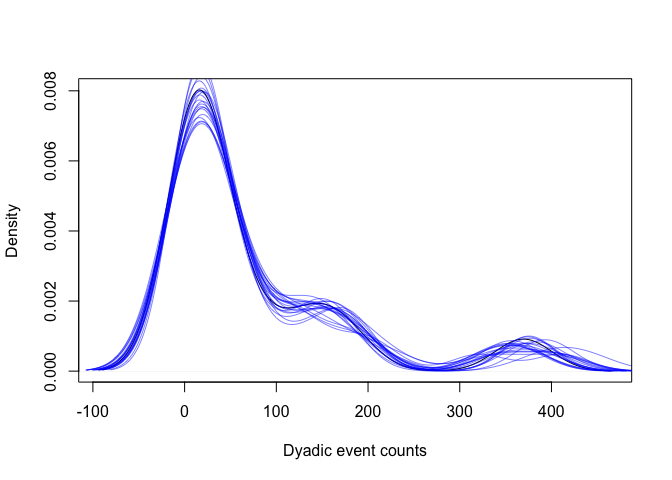
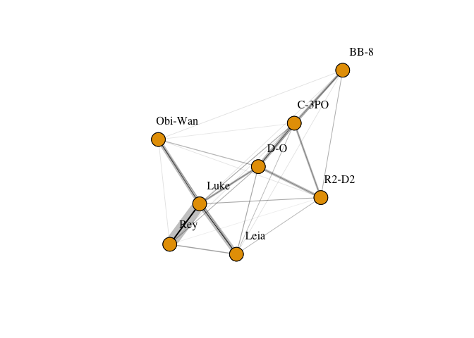

Count Data Example with INLA
================

This example covers fitting a edge weight model to count data (where the
count of social events per observation is recorded) with an
observation-level location effect, basic model checking and diagnostics,
visualising networks with uncertainty, calculating probability
distributions over network centrality, and propagating network
uncertainty into subsequent analyses.

*Note: Many of the procedures presented here are stochastic, and plots
and results may vary between compilations of this document. In
particular, MCMC chains and model estimates may sometimes not be
optimal, even if they were when it was originally written.*

# Setup

First of all we’ll load in Rstan for model fitting in Stan, dplyr for
handling the data, and igraph for network plotting and computing network
centrality. We also load in two custom R files: “simulations.R” to
generate synthetic data for this example; and “sampler.R” to allow
fitting models with uncertainty over network features respectively.

``` r
library(INLA)
library(dplyr)
library(igraph)

source("../scripts/simulations.R")
source("../scripts/sampler.R")
```

# Simulating data

Now we will simulate data using the `simulate_count()` function. The
rows of the resulting dataframe describe observations at the dyadic
level between nodes. In this dataframe, `event_count` denotes the number
of social events observed in each observation period. The exact
definition of observation period will depend on the study, but is
commonly a sampling period where at least one of the members of the dyad
was observed. This can also be a sampling period where both members of
the dyad were observed, and the distinction will affect the
interpretation of edge weights. See the paper for further discussion on
this. `location` denotes the location at which the observation took
place, which may be relevant if location is likely to impact the
visibility of social events.

``` r
set.seed(1)
data <- simulate_count()
df <- data$df
head(df)
```

    ##   node_1 node_2   type_1   type_2 event_count duration location
    ## 1    Rey   Leia Lifeform Lifeform           1        3        A
    ## 2    Rey   Leia Lifeform Lifeform           1        5        F
    ## 3    Rey   Leia Lifeform Lifeform           0        5        F
    ## 4    Rey   Leia Lifeform Lifeform           1        8        F
    ## 5    Rey   Leia Lifeform Lifeform           6        9        D
    ## 6    Rey   Leia Lifeform Lifeform           3        4        D

# Preparing the data

Computationally it’s easier to work with dyad IDs rather than pairs of
nodes in the statistical model, so we’ll map the pairs of nodes to dyad
IDs before we put the data into the model. The same is true for the
location factor, so we will also map the locations to location IDs. We
can add these columns to the dataframe using the following code:

``` r
df <- df %>%
  group_by(node_1, node_2) %>%
  mutate(dyad_id=cur_group_id()) %>%
  mutate(location_id=as.integer(location), duration=as.integer(duration))
head(df)
```

    ## # A tibble: 6 × 9
    ## # Groups:   node_1, node_2 [1]
    ##   node_1 node_2 type_1  type_2 event_count duration location dyad_id location_id
    ##   <fct>  <fct>  <fct>   <fct>        <int>    <int> <fct>      <int>       <int>
    ## 1 Rey    Leia   Lifefo… Lifef…           1        3 A              1           1
    ## 2 Rey    Leia   Lifefo… Lifef…           1        5 F              1           6
    ## 3 Rey    Leia   Lifefo… Lifef…           0        5 F              1           6
    ## 4 Rey    Leia   Lifefo… Lifef…           1        8 F              1           6
    ## 5 Rey    Leia   Lifefo… Lifef…           6        9 D              1           4
    ## 6 Rey    Leia   Lifefo… Lifef…           3        4 D              1           4

It will also be useful later to aggregate the dataframe at the dyad
level, assign dyad IDs corresponding to each dyad, and calculate total
event counts for each dyad. We can do this using:

``` r
df_agg <- df %>%
  group_by(node_1, node_2) %>%
  summarise(event_count_total=sum(event_count), dyad_id=cur_group_id(), total_duration=sum(duration)) %>%
  mutate(node_1_id=as.integer(node_1), node_2_id=as.integer(node_2))
head(df_agg)
```

    ## # A tibble: 6 × 7
    ## # Groups:   node_1 [1]
    ##   node_1 node_2  event_count_total dyad_id total_duration node_1_id node_2_id
    ##   <fct>  <fct>               <int>   <int>          <int>     <int>     <int>
    ## 1 Rey    Leia                   75       1            225         1         2
    ## 2 Rey    Obi-Wan                14       2            267         1         3
    ## 3 Rey    Luke                  367       3             48         1         4
    ## 4 Rey    C-3PO                   7       4            150         1         5
    ## 5 Rey    BB-8                    2       5            236         1         6
    ## 6 Rey    R2-D2                   2       6            198         1         7

To fit the model using INLA, we need to define it in the form of a GLM.
BISoN models don’t need an intercept (though they can be included in
modelling relative effects) so the intercept is excluded from the model
by adding a preceding `0` to the formula. Dyad ID is modelled (as a
factor) as a fixed effect, which will become our edge weight estimates,
and location is modelled as a random effect (also known as a varying
intercept). Because this model is for count (events per unit time) data,
the GLM equivalent family is the Poisson family. Because events can
happen over various total observation times, and we want to model event
rates that account for this (rather than total numbers of events), an
*offset* term must be included. In BISoN count models, the offset term
should be the natural logarithm of total observation time (duration).
The model can be built using the code below:

``` r
prior.fixed <- list(mean=0, prec=1) # specify the priors 
prior.random <- list(prec=list(prior="normal", param=c(0, 1)))

# note that in INLA it uses precision instead of SD (which is 1/SD)
df$dyad_id <- as.factor(df$dyad_id)

fit_edge <- inla(
  event_count ~ 0 + dyad_id + f(location, model="iid", hyper=prior.random) + offset(log(duration)), # model edge weights with offset term for observation effort
  family="poisson", # poisson for frequency/count data
  data=df,
  control.fixed=prior.fixed,
  control.compute=list(config = TRUE)
)
```

# Posterior predictive checks

To check the model has captured important aspects of the data well, we
can run a predictive check of the predictions of the model against the
observed event counts using the following code.

``` r
# Extract samples (including predictor values) from posterior of INLA model
inla_samples <- inla.posterior.sample(20, fit_edge)

# Plot the density of the observed event counts
plot(density(df_agg$event_count_total), main="", xlab="Dyadic event counts")

# Plot the densities of the predicted event counts, repeat for multiple samples
df_copy <- df
for (i in 1:length(inla_samples)) {
  j <- sample(1:length(inla_samples), size=1)
  df_copy$event_count <- rpois(nrow(df_copy), exp(head(inla_samples[[j]]$latent, nrow(df))))
  df_agg_copy <- df_copy %>% 
    group_by(node_1, node_2) %>%
    summarise(event_count_total=sum(event_count))
  lines(density(df_agg_copy$event_count_total), col=rgb(0, 0, 1, 0.5))
}
```

<!-- -->

This plot shows that the observed data falls well within the predicted
densities, and the predictions suggest the model has captured the main
features of the data well. Now we can be reasonably confident that the
model has fit correctly and describes the data well, so we can start to
make inferences from the model.

# Extracting edge weights

The main purpose of this part of the framework is to estimate edge
weights of dyads. We can access these using the `logit_p` quantity. This
will give a distribution of logit-scale edge weights for each dyad, akin
to an edge list. We’ll apply the logistic function `plogis` to get the
edge weights back to their original scale:

``` r
# Extract posterior samples again, this time with enough samples to construct reliable CIs
num_samples <- 1000
inla_samples <- inla.posterior.sample(num_samples, fit_edge)
log_edge_samples <- matrix(0, length(inla_samples), 28)
for (i in 1:length(inla_samples)) {
  log_edge_samples[i, ] <- tail(inla_samples[[i]]$latent, 28)
}
edge_samples <- exp(log_edge_samples) # (0, 1) scale edge weights
```

We can summarise the distribution over edge lists by calculating the
credible intervals, indicating likely values for each edge. We’ll use
the 95% credible interval in this example, but there’s no reason to
choose this interval over any other. The distribution over edge lists
can be summarised in the following code:

``` r
dyad_name <- do.call(paste, c(df_agg[c("node_1", "node_2")], sep=" <-> "))
edge_lower <- apply(edge_samples, 2, function(x) quantile(x, probs=0.025))
edge_upper <- apply(edge_samples, 2, function(x) quantile(x, probs=0.975))
edge_median <- apply(edge_samples, 2, function(x) quantile(x, probs=0.5))
edge_list <- cbind(
  "median"=round(edge_median, 3), 
  "2.5%"=round(edge_lower, 3), 
  "97.5%"=round(edge_upper, 3)
)
rownames(edge_list) <- dyad_name
edge_list
```

    ##                   median   2.5%  97.5%
    ## Rey <-> Leia       1.718  1.087  2.698
    ## Rey <-> Obi-Wan    0.284  0.147  0.506
    ## Rey <-> Luke      20.069 13.516 30.215
    ## Rey <-> C-3PO      0.259  0.116  0.485
    ## Rey <-> BB-8       0.062  0.024  0.136
    ## Rey <-> R2-D2      0.116  0.047  0.291
    ## Rey <-> D-O        0.926  0.532  1.620
    ## Leia <-> Obi-Wan   0.704  0.425  1.158
    ## Leia <-> Luke      8.551  5.829 12.854
    ## Leia <-> C-3PO     0.795  0.491  1.298
    ## Leia <-> BB-8      0.247  0.118  0.477
    ## Leia <-> R2-D2     0.772  0.437  1.301
    ## Leia <-> D-O       1.367  0.892  2.106
    ## Obi-Wan <-> Luke   6.686  4.505 10.146
    ## Obi-Wan <-> C-3PO  0.204  0.096  0.399
    ## Obi-Wan <-> BB-8   0.149  0.044  0.452
    ## Obi-Wan <-> R2-D2  0.230  0.106  0.432
    ## Obi-Wan <-> D-O    0.500  0.125  1.452
    ## Luke <-> C-3PO     1.194  0.758  1.950
    ## Luke <-> BB-8      0.223  0.095  0.444
    ## Luke <-> R2-D2     1.123  0.666  1.844
    ## Luke <-> D-O       3.595  2.382  5.436
    ## C-3PO <-> BB-8     3.957  2.641  6.145
    ## C-3PO <-> R2-D2    3.375  2.282  5.212
    ## C-3PO <-> D-O      5.964  3.889  9.105
    ## BB-8 <-> R2-D2     0.923  0.552  1.563
    ## BB-8 <-> D-O       0.609  0.269  1.169
    ## R2-D2 <-> D-O      3.185  1.731  5.515

In social network analysis, a more useful format for network data is
usually adjacency matrices, rather than edge lists, so now we’ll convert
the distribution of edge lists to a distribution of adjacency matrices,
and store the result in an 8 x 8 x 4000 tensor, as there are 8 nodes and
4000 samples from the posterior.

``` r
adj_tensor <- array(0, c(8, 8, num_samples))
log_adj_tensor <- array(0, c(8, 8, num_samples))
for (dyad_id in 1:nrow(df_agg)) {
  dyad_row <- df_agg[df_agg$dyad_id == dyad_id, ]
  adj_tensor[dyad_row$node_1_id, dyad_row$node_2_id, ] <- edge_samples[, dyad_id]
  log_adj_tensor[dyad_row$node_1_id, dyad_row$node_2_id, ] <- log_edge_samples[, dyad_id]
}
adj_tensor[, , 1] # Print the first sample of the posterior distribution over adjacency matrices
```

    ##      [,1]     [,2]      [,3]      [,4]      [,5]       [,6]      [,7]      [,8]
    ## [1,]    0 2.663991 0.6040002 27.235736 0.3455269 0.09482256 0.3130886 1.0909884
    ## [2,]    0 0.000000 0.7742271 11.315537 1.0265133 0.40045363 1.2240236 1.7640553
    ## [3,]    0 0.000000 0.0000000  8.872466 0.1615569 0.18337909 0.2980327 0.7913167
    ## [4,]    0 0.000000 0.0000000  0.000000 1.9720117 0.29616773 0.8456243 4.6136296
    ## [5,]    0 0.000000 0.0000000  0.000000 0.0000000 4.53302175 4.7376005 7.2963899
    ## [6,]    0 0.000000 0.0000000  0.000000 0.0000000 0.00000000 1.1928073 0.7130239
    ## [7,]    0 0.000000 0.0000000  0.000000 0.0000000 0.00000000 0.0000000 6.0330985
    ## [8,]    0 0.000000 0.0000000  0.000000 0.0000000 0.00000000 0.0000000 0.0000000

The adjacency matrix above corresponds to a single draw of the posterior
adjacency matrices. You’ll notice the edges have been transformed back
to the \>0 range from the log-scale scale using the exponential
function. If there are no additional effects (such as location in our
case), the transformed edge weights will be probabilities and the median
will be approximately the same as the simple ratio index for each dyad.
However, when additional effects are included, the transformed values
can no longer be interpreted directly as rates, though they will be
useful for visualisation and analysis purposes.

# Visualising uncertainty

The aim of our network visualisation is to plot a network where the
certainty in edge weights (edge weights) can be seen. To do this we’ll
use a semi-transparent line around each edge with a width that
corresponds to a uncertainty measures. The uncertainty measure will
simply be the difference between the 97.5% and 2.5% credible interval
estimate for each edge weight. We can calculate this from the
transformed adjacency tensor object, generate two igraph objects for the
main network and the uncertainty in edges, and plot them with the same
coordinates.

``` r
# Calculate lower, median, and upper quantiles of edge weights. Lower and upper give credible intervals.
adj_quantiles <- apply(adj_tensor, c(1, 2), function(x) quantile(x, probs=c(0.025, 0.5, 0.975)))
adj_lower <- adj_quantiles[1, , ]
adj_mid <- adj_quantiles[2, , ]
adj_upper <- adj_quantiles[3, , ]

# Calculate width/range of credible intervals.
adj_range <- ((adj_upper - adj_lower))
adj_range[is.nan(adj_range)] <- 0

# Generate two igraph objects, one form the median and one from the width.
g_mid <- graph_from_adjacency_matrix(adj_mid, mode="undirected", weighted=TRUE)
g_range <- graph_from_adjacency_matrix(adj_range, mode="undirected", weighted=TRUE)

# Plot the median graph first and then the width graph to show uncertainty over edges.
coords <- igraph::layout_nicely(g_mid)
plot(g_mid, edge.width=0.1 * E(g_mid)$weight, edge.color="black",  layout=coords)
plot(g_mid, edge.width=E(g_range)$weight, edge.color=rgb(0, 0, 0, 0.25), 
     vertex.label=c("Rey", "Leia", "Obi-Wan", "Luke", "C-3PO", "BB-8", "R2-D2", "D-O"), 
     vertex.label.dist=4, vertex.label.color="black", layout=coords, add=TRUE)
```

<!-- -->

This plot can be extended in multiple ways, for example by thresholding
low edge weights to visualise the network more tidily, or by adding
halos around nodes to show uncertainty around network centrality, and so
on.

# Next Steps

Now the edge weight model has been fitted, the edge weight posteriors
can be used in the various types of network analyses shown in this
repository.
