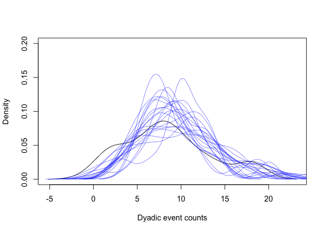

Binary Edge Weight Model for Group Data with INLA
================

Group-based data, sometimes called Gambit-of-the-Group, where
observations of groupings of individuals is assumed to represent social
events between all members of the grouping, are a common form of
behavioural data in animal social network analysis. These data can be
challenging to analyse for various reasons, but a key consideration is
the non-independence of sightings of dyads within the same grouping. We
can model this non-independence of groupings in BISoN by including a
varying intercept (random effect) term in the model, but it requires
structuring the data frame in a long format, so that each row
corresponds to each possible dyad in a sighting, including dyads where
one of the individuals was not present in the grouping. In many
empirical datasets this can generate large data frames that conventional
MCMC methods will struggle to fit in a reasonable time. Fortunately INLA
is much faster and an appropriate approximation for BISoN models of
group data. In this example we’ll use INLA to fit a BISoN model to
simulated group data.

*WARNING: Group-by-individual matrices with especially large numbers of
individuals or observations will generate very large dataframes that may
be difficult to work with and fit. This is an area for future
development we are currently working on. Until then, aggregated models
might be a useful compromise that will at least model some of the
uncertainty around edge weights. *

First load in libraries and the simulation script to generate
group-based data.

``` r
library(dplyr)
```

    ## 
    ## Attaching package: 'dplyr'

    ## The following objects are masked from 'package:stats':
    ## 
    ##     filter, lag

    ## The following objects are masked from 'package:base':
    ## 
    ##     intersect, setdiff, setequal, union

``` r
library(INLA)
```

    ## Loading required package: Matrix

    ## Loading required package: foreach

    ## Loading required package: parallel

    ## Loading required package: sp

    ## This is INLA_21.11.22 built 2021-11-21 16:13:28 UTC.
    ##  - See www.r-inla.org/contact-us for how to get help.
    ##  - To enable PARDISO sparse library; see inla.pardiso()

``` r
library(igraph)
```

    ## 
    ## Attaching package: 'igraph'

    ## The following objects are masked from 'package:dplyr':
    ## 
    ##     as_data_frame, groups, union

    ## The following objects are masked from 'package:stats':
    ## 
    ##     decompose, spectrum

    ## The following object is masked from 'package:base':
    ## 
    ##     union

``` r
source("../scripts/simulations.R")
```

## Simulate some data

Now simulate some group-based data that has already been transformed
into long format from group-by-individual matrices. Check out the
`convert_gbi.Rmd` example in the repository for more details on how this
can be done.

``` r
set.seed(123)
df <- simulate_group()
head(df)
```

    ##   node_1 node_2 social_event obs_id
    ## 1      1      2            0      1
    ## 2      1      3            1      1
    ## 3      1      4            1      1
    ## 4      1      5            0      1
    ## 5      1      6            0      1
    ## 6      1      7            1      1

## Prepare dataframe

Add dyad IDs to the dataframe and convert observation (or group) IDs to
integers

``` r
df <- df %>%
  group_by(node_1, node_2) %>%
  mutate(dyad_id=cur_group_id()) %>%
  mutate(obs_id=as.integer(obs_id))
head(df)
```

    ## # A tibble: 6 × 5
    ## # Groups:   node_1, node_2 [6]
    ##   node_1 node_2 social_event obs_id dyad_id
    ##    <dbl>  <dbl>        <dbl>  <int>   <int>
    ## 1      1      2            0      1       1
    ## 2      1      3            1      1       2
    ## 3      1      4            1      1       3
    ## 4      1      5            0      1       4
    ## 5      1      6            0      1       5
    ## 6      1      7            1      1       6

Prepare aggregated version of the matrix solely for post-processing
purposes, as it isn’t needed for model fitting.

``` r
df_agg <- df %>%
  group_by(node_1, node_2) %>%
  summarise(event_count=sum(social_event), dyad_id=cur_group_id()) %>%
  mutate(node_1_id=as.integer(node_1), node_2_id=as.integer(node_2))
```

    ## `summarise()` has grouped output by 'node_1'. You can override using the
    ## `.groups` argument.

``` r
head(df_agg)
```

    ## # A tibble: 6 × 6
    ## # Groups:   node_1 [1]
    ##   node_1 node_2 event_count dyad_id node_1_id node_2_id
    ##    <dbl>  <dbl>       <dbl>   <int>     <int>     <int>
    ## 1      1      2           6       1         1         2
    ## 2      1      3          10       2         1         3
    ## 3      1      4           8       3         1         4
    ## 4      1      5          10       4         1         5
    ## 5      1      6           4       5         1         6
    ## 6      1      7          10       6         1         7

## Fit model

Now we need to define and fit the model in formula notation for INLA.
The model definition is similar to the binary edge weight models fitted
in other examples, but this time uses a random effect over observation
ID (corresponding to grouping instances) to account for non-independence
due to shared groupings. This can be done using the following code:

``` r
# Prepare dataframe by assigning factors
df$dyad_id <- as.factor(df$dyad_id)
df$obs_id <- as.factor(df$obs_id)

# Set priors to match Stan model
prior.fixed <- list(mean=0, prec=10)
prior.random <- list(prec=list(prior="normal", param=c(0, 1)))

# Fit the INLA model
fit_edge <- inla(social_event ~ 0 + dyad_id + f(obs_id, model="iid", hyper=prior.random), 
                 family="binomial", 
                 data=df,
                 control.fixed=prior.fixed,
                 control.compute=list(config = TRUE)
)
```

We can now perform posterior predictive checks by comparing the density
of the observed event counts to the density of predicted event counts
from the model.

``` r
# Extract samples (including predictor values) from posterior of INLA model
inla_samples <- inla.posterior.sample(20, fit_edge)

# Plot the density of the observed event counts
plot(density(df_agg$event_count), main="", xlab="Dyadic event counts", ylim=c(0, 0.2))

# Plot the densities of the predicted event counts, repeat for multiple samples
df_copy <- df
for (i in 1:length(inla_samples)) {
  j <- sample(1:length(inla_samples), size=1)
  df_copy$event <- rbinom(nrow(df), 1, plogis(head(inla_samples[[j]]$latent, nrow(df))))
  df_agg_copy <- df_copy %>% 
    group_by(node_1, node_2) %>%
    summarise(event_count=sum(event))
  lines(density(df_agg_copy$event_count), col=rgb(0, 0, 1, 0.5))
}
```

    ## `summarise()` has grouped output by 'node_1'. You can override using the
    ## `.groups` argument.
    ## `summarise()` has grouped output by 'node_1'. You can override using the
    ## `.groups` argument.
    ## `summarise()` has grouped output by 'node_1'. You can override using the
    ## `.groups` argument.
    ## `summarise()` has grouped output by 'node_1'. You can override using the
    ## `.groups` argument.
    ## `summarise()` has grouped output by 'node_1'. You can override using the
    ## `.groups` argument.
    ## `summarise()` has grouped output by 'node_1'. You can override using the
    ## `.groups` argument.
    ## `summarise()` has grouped output by 'node_1'. You can override using the
    ## `.groups` argument.
    ## `summarise()` has grouped output by 'node_1'. You can override using the
    ## `.groups` argument.
    ## `summarise()` has grouped output by 'node_1'. You can override using the
    ## `.groups` argument.
    ## `summarise()` has grouped output by 'node_1'. You can override using the
    ## `.groups` argument.
    ## `summarise()` has grouped output by 'node_1'. You can override using the
    ## `.groups` argument.
    ## `summarise()` has grouped output by 'node_1'. You can override using the
    ## `.groups` argument.
    ## `summarise()` has grouped output by 'node_1'. You can override using the
    ## `.groups` argument.
    ## `summarise()` has grouped output by 'node_1'. You can override using the
    ## `.groups` argument.
    ## `summarise()` has grouped output by 'node_1'. You can override using the
    ## `.groups` argument.
    ## `summarise()` has grouped output by 'node_1'. You can override using the
    ## `.groups` argument.
    ## `summarise()` has grouped output by 'node_1'. You can override using the
    ## `.groups` argument.
    ## `summarise()` has grouped output by 'node_1'. You can override using the
    ## `.groups` argument.
    ## `summarise()` has grouped output by 'node_1'. You can override using the
    ## `.groups` argument.
    ## `summarise()` has grouped output by 'node_1'. You can override using the
    ## `.groups` argument.

<!-- -->

This plot shows that the observed data falls well within the predicted
densities, and the predictions suggest the model has captured the main
features of the data well. Now we can be reasonably confident that the
model has fit correctly and describes the data well, so we can start to
make inferences from the model.

# Extracting edge weights

The main purpose of this part of the framework is to estimate edge
weights of dyads. We can access these using the `logit_p` quantity. This
will give a distribution of logit-scale edge weights for each dyad, akin
to an edge list. We’ll apply the logistic function `plogis` to get the
edge weights back to their original scale:

``` r
num_samples <- 1000
inla_samples <- inla.posterior.sample(num_samples, fit_edge)
logit_edge_samples <- matrix(0, length(inla_samples), 28)
for (i in 1:length(inla_samples)) {
  logit_edge_samples[i, ] <- tail(inla_samples[[i]]$latent, 28)
}
edge_samples <- plogis(logit_edge_samples) # (0, 1) scale edge weights
```

We can summarise the distribution over edge lists by calculating the
credible intervals, indicating likely values for each edge. We’ll use
the 95% credible interval in this example, but there’s no reason to
choose this interval over any other. The distribution over edge lists
can be summarised in the following code:

``` r
dyad_name <- do.call(paste, c(df_agg[c("node_1", "node_2")], sep=" <-> "))
edge_lower <- apply(edge_samples, 2, function(x) quantile(x, probs=0.025))
edge_upper <- apply(edge_samples, 2, function(x) quantile(x, probs=0.975))
edge_median <- apply(edge_samples, 2, function(x) quantile(x, probs=0.5))
edge_list <- cbind(
  "median"=round(edge_median, 3), 
  "2.5%"=round(edge_lower, 3), 
  "97.5%"=round(edge_upper, 3)
)
rownames(edge_list) <- dyad_name
edge_list
```

    ##         median  2.5% 97.5%
    ## 1 <-> 2  0.463 0.349 0.594
    ## 1 <-> 3  0.488 0.371 0.609
    ## 1 <-> 4  0.464 0.342 0.588
    ## 1 <-> 5  0.477 0.352 0.595
    ## 1 <-> 6  0.417 0.292 0.535
    ## 1 <-> 7  0.525 0.413 0.646
    ## 1 <-> 8  0.420 0.297 0.553
    ## 2 <-> 3  0.439 0.321 0.572
    ## 2 <-> 4  0.383 0.274 0.510
    ## 2 <-> 5  0.553 0.437 0.669
    ## 2 <-> 6  0.465 0.346 0.586
    ## 2 <-> 7  0.407 0.276 0.536
    ## 2 <-> 8  0.432 0.306 0.558
    ## 3 <-> 4  0.579 0.464 0.693
    ## 3 <-> 5  0.562 0.445 0.688
    ## 3 <-> 6  0.484 0.371 0.607
    ## 3 <-> 7  0.523 0.396 0.636
    ## 3 <-> 8  0.490 0.368 0.620
    ## 4 <-> 5  0.567 0.458 0.679
    ## 4 <-> 6  0.523 0.409 0.635
    ## 4 <-> 7  0.475 0.349 0.600
    ## 4 <-> 8  0.461 0.337 0.584
    ## 5 <-> 6  0.530 0.409 0.647
    ## 5 <-> 7  0.448 0.334 0.563
    ## 5 <-> 8  0.475 0.355 0.592
    ## 6 <-> 7  0.490 0.358 0.616
    ## 6 <-> 8  0.378 0.256 0.507
    ## 7 <-> 8  0.457 0.332 0.588

# Next steps

Now the posterior edge weights can be used in any downstream analyses
and visualisations, as they would be used for any of the other BISoN
models. Check out the Github repository for more examples.
