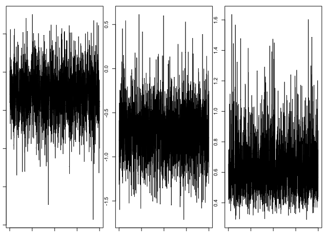

Nodal Regression with Metropolis
================

Nodal regression is a regression-based analysis often used in social
network analysis to determine factors that may be associated with
node-level network properties, for example if age or sex predicts
network centrality. In this notebook we will use edge weight posteriors
from a previously-run edge weight model to conduct a nodal regression of
eigenvector centrality against node type. In our toy example, node type
will be either `lifeform` or `droid`.

BISoN adopts a fully Bayesian philosophy, so not only does it use edge
weight models to estimate uncertainty over edge weights, but it also
propagates this uncertainty through downstream analyses, such as nodal
regression in this case. There are several ways uncertainty over edge
weights can be included in regression analyses, but in this example we
will use a Metropolis-Hastings sampler to sample over both posterior
centrality estimates *and* the parameter space to model the joint
distribution of posterior centralities.

# Setup and Loading the edge weights

We’ll load edge weight posteriors in from a previous run model using the
`readRDS()` function. These data were generated by the `ewm_binary.Rmd`
example in the Github repository.

``` r
library(rstan)
```

    ## Loading required package: StanHeaders

    ## Loading required package: ggplot2

    ## rstan (Version 2.21.3, GitRev: 2e1f913d3ca3)

    ## For execution on a local, multicore CPU with excess RAM we recommend calling
    ## options(mc.cores = parallel::detectCores()).
    ## To avoid recompilation of unchanged Stan programs, we recommend calling
    ## rstan_options(auto_write = TRUE)

``` r
library(igraph)
```

    ## 
    ## Attaching package: 'igraph'

    ## The following objects are masked from 'package:stats':
    ## 
    ##     decompose, spectrum

    ## The following object is masked from 'package:base':
    ## 
    ##     union

``` r
library(tidyverse)
```

    ## ── Attaching packages ─────────────────────────────────────── tidyverse 1.3.1 ──

    ## ✓ tibble  3.1.6     ✓ dplyr   1.0.8
    ## ✓ tidyr   1.2.0     ✓ stringr 1.4.0
    ## ✓ readr   2.1.2     ✓ forcats 0.5.1
    ## ✓ purrr   0.3.4

    ## ── Conflicts ────────────────────────────────────────── tidyverse_conflicts() ──
    ## x dplyr::as_data_frame() masks tibble::as_data_frame(), igraph::as_data_frame()
    ## x purrr::compose()       masks igraph::compose()
    ## x tidyr::crossing()      masks igraph::crossing()
    ## x tidyr::extract()       masks rstan::extract()
    ## x dplyr::filter()        masks stats::filter()
    ## x dplyr::groups()        masks igraph::groups()
    ## x dplyr::lag()           masks stats::lag()
    ## x purrr::simplify()      masks igraph::simplify()

``` r
source("../scripts/sampler.R")

data <- readRDS("../example_data/binary.RData")
df <- data$df
df_agg <- data$df_agg
logit_edge_samples <- data$logit_edge_samples
```

# Computing centralities

Before we can use centralities in the regression, we must calculate them
over the posterior edge weights. We’ll use eigenvector centrality as the
centrality measure in this example, but any centrality metric can be
used. Centrality posteriors can be calculated using the following code:

``` r
# Build adjacency tensor (4000 x 8 x 8 array of edge weights)
edge_samples <- plogis(logit_edge_samples)
adj_tensor <- array(0, c(4000, 8, 8))
for (dyad_id in 1:nrow(df_agg)) {
  dyad_row <- df_agg[df_agg$dyad_id == dyad_id, ]
  adj_tensor[, dyad_row$node_1_id, dyad_row$node_2_id] <- edge_samples[, dyad_id]
}

# Calculate centrality and store posterior samples in a matrix
centrality_samples <- matrix(0, 4000, 8)
centrality_samples_std <- matrix(0, 4000, 8)
for (i in 1:4000) {
  g <- graph_from_adjacency_matrix(adj_tensor[i, , ], mode="undirected", weighted=TRUE)
  centrality_samples[i, ] <- eigen_centrality(g)$vector
  centrality_samples_std[i, ] <- (centrality_samples[i, ] - mean(centrality_samples[i, ]))/sd(centrality_samples[i, ])
}
head(centrality_samples) # Unstandardised eigenvector centrality
```

    ##           [,1]      [,2] [,3]      [,4]      [,5]      [,6]      [,7]      [,8]
    ## [1,] 0.8903686 0.9637529    1 0.9389145 0.5049571 0.8243466 0.5659694 0.2652065
    ## [2,] 0.9101940 0.9197402    1 0.9726799 0.6248272 0.8278425 0.5137988 0.2169508
    ## [3,] 0.8996659 0.8913441    1 0.9592490 0.5069681 0.8224934 0.4965188 0.2225705
    ## [4,] 0.9071611 0.9162472    1 0.9993787 0.5737260 0.8586543 0.5556993 0.2945746
    ## [5,] 0.8485677 0.8883311    1 0.9986871 0.5167451 0.8085251 0.5396104 0.3396272
    ## [6,] 0.9157121 0.9328924    1 0.9667868 0.5444870 0.8443323 0.5682344 0.2477288

``` r
head(centrality_samples_std) # Standardised eigenvector centrality
```

    ##           [,1]      [,2]      [,3]      [,4]       [,5]      [,6]       [,7]
    ## [1,] 0.5481719 0.8233630 0.9592897 0.7302191 -0.8971214 0.3005893 -0.6683253
    ## [2,] 0.5895289 0.6242812 0.9164605 0.8170040 -0.4493261 0.2897349 -0.8535160
    ## [3,] 0.6234538 0.5937753 0.9812823 0.8359493 -0.7770519 0.3482279 -0.8143178
    ## [4,] 0.5594282 0.5947317 0.9201475 0.9177334 -0.7361113 0.3709582 -0.8061527
    ## [5,] 0.4313061 0.5930150 1.0471473 1.0418081 -0.9181424 0.2684615 -0.8251544
    ## [6,] 0.6064892 0.6703390 0.9197412 0.7963060 -0.7731512 0.3412095 -0.6848949
    ##           [,8]
    ## [1,] -1.796186
    ## [2,] -1.934167
    ## [3,] -1.791319
    ## [4,] -1.820735
    ## [5,] -1.638441
    ## [6,] -1.876039

# Preparing the data

Now that the edge weights are loaded, we need to prepare the data for
fitting the regression model. This involves 1) preparing a response
matrix of centralities describing the distribution of centralities for
edge node, and 2) building a predictor matrix indicating the node type
of each node (“lifeform” or “droid”).

``` r
predictor_matrix <- matrix(0, 8, 1)
colnames(predictor_matrix) <- c("node_type")
predictor_matrix[, 1] <- c(1, 1, 1, 1, 2, 2, 2, 2)
predictor_matrix
```

    ##      node_type
    ## [1,]         1
    ## [2,]         1
    ## [3,]         1
    ## [4,]         1
    ## [5,]         2
    ## [6,]         2
    ## [7,]         2
    ## [8,]         2

# Defining the model

Now everything else is in place, it’s time to define the model. As in
Stan, the model will be defined by its log-likelihood function, but
since we’re using a custom Metropolis sampler directly in R, the
log-likelihood function will need to be written directly in R. Writing
likelihood functions is beyond the scope of this tutorial, but a good
resource on the topic can be found here:
<https://www.ime.unicamp.br/~cnaber/optim_1.pdf>.

The dyadic regression model we’ll be using will predict the standardised
centrality (Z-score) using a Gaussian family model where dyad type is
the main effect, and multi-membership terms are included as random
effects to account for non-independence between edges due to nodes.
Priors are set relatively narrow to improve model fit for the purposes
of this example, but in any real analysis they should be determined by
domain knowledge and predictive checks.

``` r
loglik_nodalreg <- function(params, Y, X, index) {
  ### Define parameters ###
  beta_nodetype <- params[1:2]
  sigma <- exp(params[3]) # Exponential keeps underlying value unconstrained, which is much easier for the sampler.
  
  ### Sample data according to index ###
  y <- Y[index %% dim(Y)[1] + 1, ]
  
  ### Define model ###
  
  target <- 0
  
  ## Linear predictor ##
  # y ~ normal(b_intercept + b_dyadtype + mm[i] + mm[j], sigma)
  target <- target + sum(dnorm(y, mean=beta_nodetype[X[, 1]], sd=sigma, log=TRUE)) # Main model
  # b_dyadtype ~ normal(0, 0.5)
  target <- target + sum(dnorm(beta_nodetype, mean=0, sd=1, log=TRUE))
  # sigma ~ exponential(1)
  target <- target + dexp(sigma, rate=1, log=TRUE)
  
  return(target)
}

# Create the `target` function that evaluates the log-likelihood on the dataset.
target <- function(params, index) loglik_nodalreg(params, centrality_samples_std, predictor_matrix, index)
```

We now have a function `target(params, index)` that gives the
log-likelihood of a set of parameters `params` given the data, for a
particular sample of the posterior edge weights, `index`. Let’s make
sure it works on an initial set of parameters all set to zero, for an
arbitrary index of the data. Note that the standard deviation parameters
are transformed by an exponential in the log-likelihood function, so the
sampler will treat them on the log-scale, meaning log(sigma) = 0 is
equivalent to sigma = 1.

``` r
target(rep(0, 3), 1)
```

    ## [1] -13.68939

The function has evaluated to a real number, so everything appears to be
working okay so far. Now we can use the function `metropolis` from
`sampler.R` to fit the model using the provided target function, an
initial set of parameters (again, all zeros), and some additional MCMC
options. Once the sampler has run, we will print out the top few rows of
the chains.

``` r
chain <- metropolis(target, rep(0, 3), iterations=200000, thin=100, refresh=10000)
```

    ## Chain: 1 | Iteration: 10000/202000 (Sampling)
    ## Chain: 1 | Iteration: 20000/202000 (Sampling)
    ## Chain: 1 | Iteration: 30000/202000 (Sampling)
    ## Chain: 1 | Iteration: 40000/202000 (Sampling)
    ## Chain: 1 | Iteration: 50000/202000 (Sampling)
    ## Chain: 1 | Iteration: 60000/202000 (Sampling)
    ## Chain: 1 | Iteration: 70000/202000 (Sampling)
    ## Chain: 1 | Iteration: 80000/202000 (Sampling)
    ## Chain: 1 | Iteration: 90000/202000 (Sampling)
    ## Chain: 1 | Iteration: 100000/202000 (Sampling)
    ## Chain: 1 | Iteration: 110000/202000 (Sampling)
    ## Chain: 1 | Iteration: 120000/202000 (Sampling)
    ## Chain: 1 | Iteration: 130000/202000 (Sampling)
    ## Chain: 1 | Iteration: 140000/202000 (Sampling)
    ## Chain: 1 | Iteration: 150000/202000 (Sampling)
    ## Chain: 1 | Iteration: 160000/202000 (Sampling)
    ## Chain: 1 | Iteration: 170000/202000 (Sampling)
    ## Chain: 1 | Iteration: 180000/202000 (Sampling)
    ## Chain: 1 | Iteration: 190000/202000 (Sampling)
    ## Chain: 1 | Iteration: 200000/202000 (Sampling)
    ## Acceptance Rate: 0.22469801980198

``` r
chain[, 3] <- exp(chain[, 3])
colnames(chain) <- c("b_lifeform", "b_droid", "sigma")
head(chain)
```

    ##      b_lifeform    b_droid     sigma
    ## [1,]  0.6157228 -1.3152008 0.6553135
    ## [2,]  0.5997483 -0.5883987 0.5906998
    ## [3,]  1.0177988 -0.8086998 0.5121928
    ## [4,]  0.9692682 -0.9995611 0.4210394
    ## [5,]  0.7069929 -0.3893741 0.7478319
    ## [6,]  1.1924890 -0.8182122 0.6476125

The acceptance rate is around 0.23, which is the target acceptance rate
for this sampler. Deviances from 0.23 could indicate sampling issues,
but the converse is not true, so acceptance rate isn’t an ideal
diagnostic tool. Instead it’s best to inspect the traceplots, which can
be done using the following code:

``` r
par(mfrow=c(1, 3), mar=c(1,1,1,1))
for (i in 1:3) {
  plot(chain[, i], type="l")
}
```

<!-- -->
**Note: In our runs of the code, these traces usually look good. But the
stochastic nature of MCMC and the experimental sampler mean that
sometimes the chains may not behave well. If the chains in this notebook
have not converged, this is likely an artefact of this stochasticity.**

At this point it’s a good idea to do some diagnostic checks, such as
predictive checks or residual plots. These are covered separately in the
Github repository, so in-depth diagnostic checks aren’t shown here, but
should always be carried out.

# Posterior predictive checks

We will run a brief diagnostic check by comparing the density of
expected edge weights (draws of which are shown in black) against the
density of predicted edge weights from the regression model (draws of
which are shown in blue).

``` r
plot(density(centrality_samples_std[1, ]), col=rgb(0, 0, 0, 0.25), ylim=c(0, 0.8), main="Posterior predictive density", xlab="Logit edge weight")
for (i in 1:100) {
  j <- sample(1:2000, 1)
  lines(density(centrality_samples_std[j, ]), col=rgb(0, 0, 0, 0.25))
  lines(density(
    rnorm(8, mean=chain[j, 1:2][predictor_matrix[, 1]], sd=chain[j, 3])
  ),
  col=rgb(0, 0, 1, 0.25))
}
```

<!-- -->

Almost all of the expected (black) densities fall within the range
expected from the predicted (blue) densities. The distribution of edge
weights appears to have been captured well by the regression model.
There are many other types of diagnostic check that could be carried
out, but we won’t go into detail here. See the github repository page
for more information.

# Interpreting the model

Assuming we’ve now carried out any diagnostics we think are appropriate,
it’s finally time to answer the scientific questions that led us to
conduct the analysis. We can start off by calculating the 95% credible
intervals of the model parameters. This can be done using the following
code:

``` r
summary_matrix <- t(apply(chain, 2, function(x) quantile(x, probs=c(0.5, 0.025, 0.975))))
summary_matrix <- round(summary_matrix, 2)
summary_matrix
```

    ##              50%  2.5% 97.5%
    ## b_lifeform  0.71  0.08  1.35
    ## b_droid    -0.72 -1.32 -0.10
    ## sigma       0.60  0.37  1.08

At this point it becomes clear that the regression we’ve conducted is
not exactly the same as what might be expected from standard frequentist
regressions, where categories are interpreted relative to a reference
category. Instead, a parameter is estimated for each category, and we
can use *contrasts* to calculate the magnitude of differences between
categories of interest. Contrasts are easily calculated as the statistic
of interest from the posteriors of the model. Namely, if we’re interest
in whether lifeform-lifeform edges are stronger than lifeform-droid
edges, we simply compute the difference in posteriors between `b_ll` and
`b_ld`. This can be done using the following code:

``` r
b_diff <- chain[, "b_lifeform"] - chain[, "b_droid"]
plot(density(b_diff), main="Posterior difference between dyad types")
abline(v=0, lty=2)
```

<!-- -->

``` r
b_diff_summary <- round(quantile(b_diff, probs=c(0.5, 0.025, 0.975)), 2)
b_diff_summary
```

    ##   50%  2.5% 97.5% 
    ##  1.44  0.51  2.30

This gives us an estimate that lifeforms have an eigenvector centrality
of around \~1.4 standard deviations higher than droids, with a 95%
credible interval of approximately (0.5, 2.3).

# Conclusion

This notebook has given a brief overview of how to fit and interpret a
dyadic regression model using the Metropolis-Hastings sampler in BISoN.
We also have a guide on how to conduct the same type of analysis in Stan
(examples/dyadic_regression.Rmd) using a Gaussian approximation of edge
weights, which should yield similar results and may be less prone to
model fitting issues, at the cost of being less flexible for some types
of model.
