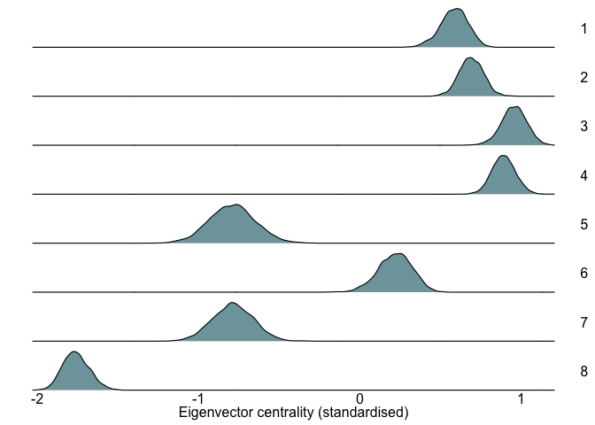
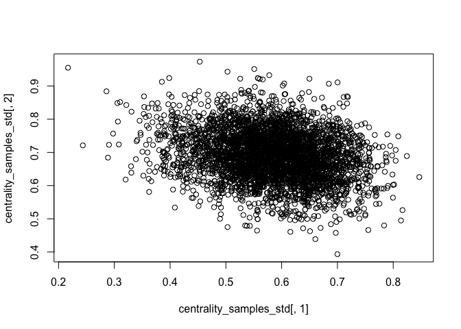
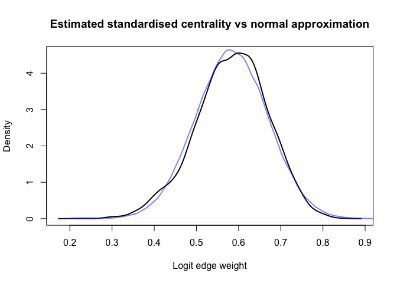
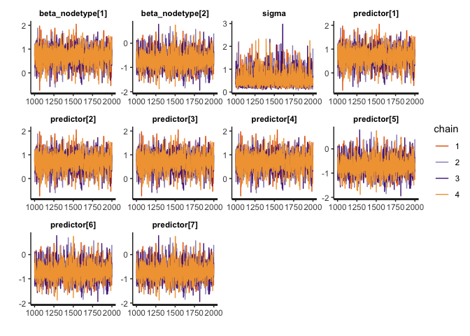
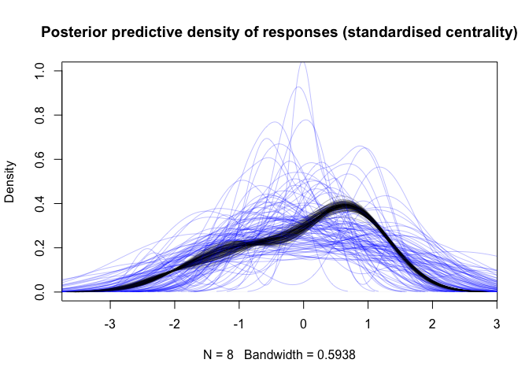
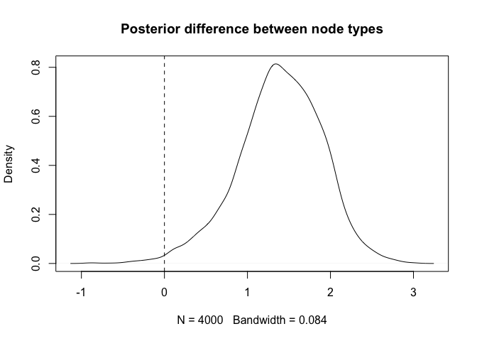

Nodal Regression with Stan
================

Nodal regression is a regression-based analysis often used in social
network analysis to determine factors that may be associated with
node-level network properties, for example if age or sex predicts
network centrality. In this notebook we will use edge weight posteriors
from a previously-run edge weight model to conduct a nodal regression of
eigenvector centrality against node type. In our toy example, node type
will be either `lifeform` or `droid`.

BISoN adopts a fully Bayesian philosophy, so not only does it use edge
weight models to estimate uncertainty over edge weights, but it also
propagates this uncertainty through downstream analyses, such as nodal
regression in this case. There are several ways uncertainty over edge
weights can be included in regression analyses, but in this example we
will use a normal approximation of network centrality posteriors in a
Stan model to propagate uncertainty.

# Setup and Loading the edge weights

We’ll load edge weight posteriors in from a previous run model using the
`readRDS()` function. These data were generated by the `ewm_binary.Rmd`
example in the Github repository.

``` r
library(rstan)
```

    ## Loading required package: StanHeaders

    ## Loading required package: ggplot2

    ## rstan (Version 2.21.3, GitRev: 2e1f913d3ca3)

    ## For execution on a local, multicore CPU with excess RAM we recommend calling
    ## options(mc.cores = parallel::detectCores()).
    ## To avoid recompilation of unchanged Stan programs, we recommend calling
    ## rstan_options(auto_write = TRUE)

``` r
library(igraph)
```

    ## 
    ## Attaching package: 'igraph'

    ## The following objects are masked from 'package:stats':
    ## 
    ##     decompose, spectrum

    ## The following object is masked from 'package:base':
    ## 
    ##     union

``` r
library(tidyverse)
```

    ## ── Attaching packages ─────────────────────────────────────── tidyverse 1.3.1 ──

    ## ✓ tibble  3.1.6     ✓ dplyr   1.0.8
    ## ✓ tidyr   1.2.0     ✓ stringr 1.4.0
    ## ✓ readr   2.1.2     ✓ forcats 0.5.1
    ## ✓ purrr   0.3.4

    ## ── Conflicts ────────────────────────────────────────── tidyverse_conflicts() ──
    ## x dplyr::as_data_frame() masks tibble::as_data_frame(), igraph::as_data_frame()
    ## x purrr::compose()       masks igraph::compose()
    ## x tidyr::crossing()      masks igraph::crossing()
    ## x tidyr::extract()       masks rstan::extract()
    ## x dplyr::filter()        masks stats::filter()
    ## x dplyr::groups()        masks igraph::groups()
    ## x dplyr::lag()           masks stats::lag()
    ## x purrr::simplify()      masks igraph::simplify()

``` r
data <- readRDS("../example_data/binary.RData")
df <- data$df
df_agg <- data$df_agg
logit_edge_samples <- data$logit_edge_samples
```

# Defining the model

The nodal regression model we’ll be using will predict node centrality
using a Gaussian family model where node type is the main and only
effect. Since node centralities will almost always co-vary, we need to
model the joint posterior distributions over network centrality as the
response variable in the regression model. This can be achieved by
modelling the posterior mean centralities `y_mu` as outcomes of a
multivariate normal with a covariance matrix `y_sigma`, calculated from
the centrality posteriors. In Stan this looks like:

`centrality_mu ~ multi_normal(predictor, centrality_cov + diag_matrix(rep_vector(square(sigma), N)));`

where `predictor` is the predictor term (like `a + b * x` in simple
linear regression). Modelling centralities with a multivariate normal
allows the joint uncertainty over centralities to be taken into account
by the model. Weakly informative priors are used in this example, but in
any real analysis they should be determined by domain knowledge and
predictive checks.

``` r
model_nodal <- stan_model("../models/nodal_regression.stan")
```

    ## Trying to compile a simple C file

    ## Running /Library/Frameworks/R.framework/Resources/bin/R CMD SHLIB foo.c
    ## clang -mmacosx-version-min=10.13 -I"/Library/Frameworks/R.framework/Resources/include" -DNDEBUG   -I"/Library/Frameworks/R.framework/Versions/4.1/Resources/library/Rcpp/include/"  -I"/Library/Frameworks/R.framework/Versions/4.1/Resources/library/RcppEigen/include/"  -I"/Library/Frameworks/R.framework/Versions/4.1/Resources/library/RcppEigen/include/unsupported"  -I"/Library/Frameworks/R.framework/Versions/4.1/Resources/library/BH/include" -I"/Library/Frameworks/R.framework/Versions/4.1/Resources/library/StanHeaders/include/src/"  -I"/Library/Frameworks/R.framework/Versions/4.1/Resources/library/StanHeaders/include/"  -I"/Library/Frameworks/R.framework/Versions/4.1/Resources/library/RcppParallel/include/"  -I"/Library/Frameworks/R.framework/Versions/4.1/Resources/library/rstan/include" -DEIGEN_NO_DEBUG  -DBOOST_DISABLE_ASSERTS  -DBOOST_PENDING_INTEGER_LOG2_HPP  -DSTAN_THREADS  -DBOOST_NO_AUTO_PTR  -include '/Library/Frameworks/R.framework/Versions/4.1/Resources/library/StanHeaders/include/stan/math/prim/mat/fun/Eigen.hpp'  -D_REENTRANT -DRCPP_PARALLEL_USE_TBB=1   -I/usr/local/include   -fPIC  -Wall -g -O2  -c foo.c -o foo.o
    ## In file included from <built-in>:1:
    ## In file included from /Library/Frameworks/R.framework/Versions/4.1/Resources/library/StanHeaders/include/stan/math/prim/mat/fun/Eigen.hpp:13:
    ## In file included from /Library/Frameworks/R.framework/Versions/4.1/Resources/library/RcppEigen/include/Eigen/Dense:1:
    ## In file included from /Library/Frameworks/R.framework/Versions/4.1/Resources/library/RcppEigen/include/Eigen/Core:88:
    ## /Library/Frameworks/R.framework/Versions/4.1/Resources/library/RcppEigen/include/Eigen/src/Core/util/Macros.h:628:1: error: unknown type name 'namespace'
    ## namespace Eigen {
    ## ^
    ## /Library/Frameworks/R.framework/Versions/4.1/Resources/library/RcppEigen/include/Eigen/src/Core/util/Macros.h:628:16: error: expected ';' after top level declarator
    ## namespace Eigen {
    ##                ^
    ##                ;
    ## In file included from <built-in>:1:
    ## In file included from /Library/Frameworks/R.framework/Versions/4.1/Resources/library/StanHeaders/include/stan/math/prim/mat/fun/Eigen.hpp:13:
    ## In file included from /Library/Frameworks/R.framework/Versions/4.1/Resources/library/RcppEigen/include/Eigen/Dense:1:
    ## /Library/Frameworks/R.framework/Versions/4.1/Resources/library/RcppEigen/include/Eigen/Core:96:10: fatal error: 'complex' file not found
    ## #include <complex>
    ##          ^~~~~~~~~
    ## 3 errors generated.
    ## make: *** [foo.o] Error 1

# Calculate posterior centralities

To parameterise the multivariate normal approximation, we use the sample
mean and covariance matrix, calculated from the posterior centrality
samples. But first we need to actually calculate the posterior
centralities. We will be using eigenvector centrality in this example,
which is bounded between 0 and 1. We plan on using a Gaussian family
regression model as they are generally easier to interpret and fit. The
response of a Gaussian regression is expected to be unbounded, so we
will standardise eigenvector centrality. Centrality posteriors can be
calculated and standardised using the followign code:

``` r
# Build adjacency tensor (4000 x 8 x 8 array of edge weights)
edge_samples <- plogis(logit_edge_samples)
adj_tensor <- array(0, c(4000, 8, 8))
for (dyad_id in 1:nrow(df_agg)) {
  dyad_row <- df_agg[df_agg$dyad_id == dyad_id, ]
  adj_tensor[, dyad_row$node_1_id, dyad_row$node_2_id] <- edge_samples[, dyad_id]
}

# Calculate centrality and store posterior samples in a matrix
centrality_samples <- matrix(0, 4000, 8)
centrality_samples_std <- matrix(0, 4000, 8)
for (i in 1:4000) {
  g <- graph_from_adjacency_matrix(adj_tensor[i, , ], mode="undirected", weighted=TRUE)
  centrality_samples[i, ] <- eigen_centrality(g)$vector
  centrality_samples_std[i, ] <- (centrality_samples[i, ] - mean(centrality_samples[i, ]))/sd(centrality_samples[i, ])
}
head(centrality_samples) # Unstandardised eigenvector centrality
```

    ##           [,1]      [,2] [,3]      [,4]      [,5]      [,6]      [,7]      [,8]
    ## [1,] 0.9329451 0.9407670    1 0.9607650 0.5235156 0.7649394 0.5299767 0.2884054
    ## [2,] 0.9126702 0.9283651    1 0.9877760 0.5870310 0.8335236 0.5526862 0.2495745
    ## [3,] 0.9172278 0.9309556    1 0.9515510 0.5612644 0.7844238 0.5568128 0.2639943
    ## [4,] 0.8967898 0.9141167    1 0.9549245 0.5850698 0.8080737 0.5978288 0.2396102
    ## [5,] 0.9079743 0.9096588    1 0.9619206 0.5600356 0.8035163 0.5645251 0.2651380
    ## [6,] 0.9275520 0.9091936    1 0.9668871 0.4458110 0.8215622 0.5793479 0.2933666

``` r
head(centrality_samples_std) # Standardised eigenvector centrality
```

    ##           [,1]      [,2]      [,3]      [,4]       [,5]       [,6]       [,7]
    ## [1,] 0.7196711 0.7492546 0.9732828 0.8248902 -0.8288537 0.08424782 -0.8044167
    ## [2,] 0.5845842 0.6433163 0.9113836 0.8656397 -0.6340006 0.28840696 -0.7625233
    ## [3,] 0.6588495 0.7116031 0.9769289 0.7907476 -0.7090570 0.14850639 -0.7261637
    ## [4,] 0.5699237 0.6369922 0.9694260 0.7949494 -0.6366704 0.22652479 -0.5872833
    ## [5,] 0.6253230 0.6318504 0.9819128 0.8343593 -0.7229017 0.22055975 -0.7055055
    ## [6,] 0.6897652 0.6211634 0.9604893 0.8367527 -1.1104064 0.29370212 -0.6114050
    ##           [,8]
    ## [1,] -1.718076
    ## [2,] -1.896807
    ## [3,] -1.851415
    ## [4,] -1.973862
    ## [5,] -1.865598
    ## [6,] -1.680061

Computing these matrices is essential for model fitting, but it’s hard
to understand differences in centralities intuitively from these raw
values. Instead we can visualise the centralities of each node using the
following code, using tidyverse as it simplifies the process:

``` r
df_wide <- data.frame(centrality_samples_std)
colnames(df_wide) <- 1:8
df_long <- pivot_longer(df_wide, cols=1:8, names_to="node_id", values_to="Centrality")
ggplot(df_long, aes(x=Centrality)) +
  geom_density(fill="#387780", alpha=0.7, size=0.4) +
  facet_grid(rows=vars(as.factor(node_id)), scales="free") +
  labs(x="Eigenvector centrality (standardised)") + 
  theme_void() + 
  theme(strip.text.y=element_text(size=12), axis.text.x = element_text(angle = 0, size=12, debug = FALSE), axis.title.x=element_text(size=12), plot.margin = unit(c(0.2,0.2,0.2,0.2), "cm"))
```

<!-- -->

This kind of plot can be helpful to understand the data and diagnose
issues later on.

# Compute normal approximation

The posterior centralities can now be characterised by the multivariate
normal distribution as an approximation to their true posterior
distributions. To highlight the importance of sampling from a
multivariate normal rather than a univariate normal, we can plot
centrality samples from two nodes against each other to see how they
co-vary.

``` r
plot(centrality_samples_std[, 1], centrality_samples_std[, 2])
```

<!-- -->
This joint distribution contains important information that we would
ideally like to include in the model. The multivariate normal will allow
us to do this. Parameterising the multivariate normal approximation is a
relatively simple process and can be done by calculating the sample mean
and sample covariance matrix of the posterior centrality samples:

``` r
centrality_mu <- apply(centrality_samples_std, 2, mean)
centrality_cov <- cov(centrality_samples_std)
```

These quantities will be given to the Stan model as data to model joint
posteriors of centrality in the regression. We can run a few quick plots
to see how well the approximation is working and the covariance for one
of the nodes:

``` r
centrality_samples_sim <- MASS::mvrnorm(1e5, centrality_mu, centrality_cov)

plot(density(centrality_samples_std[, 1]), lwd=2, main="Estimated standardised centrality vs normal approximation", xlab="Logit edge weight")
lines(density(centrality_samples_sim[, 1]), col=rgb(0, 0, 1, 0.5), lwd=2)
```

<!-- -->
If we’re happy with the approximation, we can now get ready to fit the
model.

# Fit the model

The model can be fitted using the following code:

``` r
model_data <- list(
  num_nodes = 8, # Number of dyads
  centrality_mu = centrality_mu, # Sample means of logit edge weights
  centrality_cov = centrality_cov, # Sample covariance of logit edge weights
  node_type = c(1, 1, 1, 1, 2, 2, 2, 2) # Integer node types corresponding to "lifeform" and "droid"
)

fit_nodal <- sampling(model_nodal, data=model_data, cores=4)
```

# Diagnostics

Now the model is fitted, we can check the traceplots to make sure the
chains have converged.

``` r
traceplot(fit_nodal)
```

    ## 'pars' not specified. Showing first 10 parameters by default.

<!-- -->

The chains are stationary and well-mixed so we should be able to proceed
with model diagnostics.

# Posterior predictive checks

We will run a brief diagnostic check by comparing the density of
expected centralities (draws of which are shown in black) against the
density of predicted centralities from the regression model (draws of
which are shown in blue).

``` r
params <- rstan::extract(fit_nodal)
plot(density(centrality_samples_std[1, ]), main="Posterior predictive density of responses (standardised centrality)", col=rgb(0, 0, 0, 0.25), ylim=c(0, 1))
for (i in 1:100) {
  j <- sample(1:4000, 1)
  lines(density(centrality_samples_std[j, ]), col=rgb(0, 0, 0, 0.25))
  mu <- params$beta_nodetype[j, model_data$node_type]
  sigma <- centrality_cov + diag(rep(params$sigma[j], 8))
  lines(density(MASS::mvrnorm(1, mu, sigma)), col=rgb(0, 0, 1, 0.25))
}
```

<!-- -->
Almost all of the expected (black) densities fall within the range
expected from the predicted (blue) densities. The distribution of
centralities appears to have been captured reasonably by the regression
model, but the regression model indicates a lot of variance around
predicted values, indicating potential scope for improving the
regression model. There are many other types of diagnostic check that
could be carried out, but we won’t go into detail here. See the github
repository page for more information.

# Interpreting the model

Assuming we’ve now carried out any diagnostics we think are appropriate,
it’s finally time to answer the scientific questions that led us to
conduct the analysis. We can start off by calculating the 95% credible
intervals of the model parameters. This can be done using the following
code:

``` r
round(summary(fit_nodal)$summary[1:3, c(1, 4, 8)], 2)
```

    ##                   mean  2.5% 97.5%
    ## beta_nodetype[1]  0.70 -0.03  1.41
    ## beta_nodetype[2] -0.69 -1.35  0.07
    ## sigma             0.56  0.17  1.41

At this point it becomes clear that the regression we’ve conducted is
not exactly the same as what might be expected from standard frequentist
regressions, where categories are interpreted relative to a reference
category. Instead, a parameter is estimated for each category, and we
can use *contrasts* to calculate the magnitude of differences between
categories of interest. Contrasts are easily calculated as the statistic
of interest from the posteriors of the model. Namely, if we’re interest
in whether lifeform nodes are more central than droid nodes, we simply
compute the difference in posteriors between `beta_nodetype[1]` and
`beta_nodetype[2]`. This can be done using the following code:

``` r
params <- rstan::extract(fit_nodal)
beta_diff <- params$beta_nodetype[, 1] - params$beta_nodetype[, 2]
plot(density(beta_diff), main="Posterior difference between node types")
abline(v=0, lty=2)
```

<!-- -->

``` r
beta_diff_summary <- round(quantile(beta_diff, probs=c(0.5, 0.025, 0.975)), 2)
beta_diff_summary
```

    ##   50%  2.5% 97.5% 
    ##  1.41  0.29  2.31

This gives us an estimate that lifeforms have an eigenvector centrality
of around \~1.4 standard deviations higher than droids, with a 95%
credible interval of approximately (0.3, 2.4).

# Conclusion

This notebook has given a brief overview of how to fit and interpret a
nodal regression model using a normal approximation of eigenvector
centrality in Stan.
